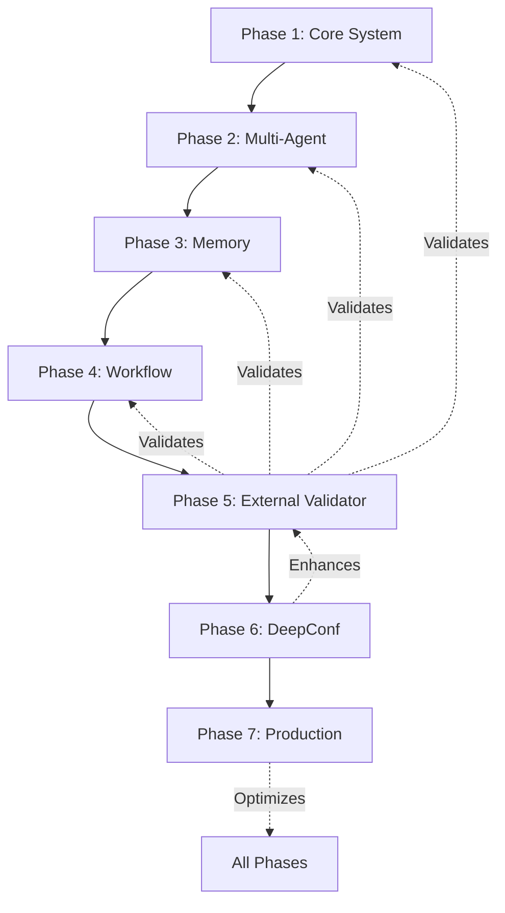

# Archon Development Phases - Updated Roadmap

## Phase Status Overview

| Phase | Name | Status | Completion Date | Key Achievement |
|-------|------|--------|-----------------|-----------------|
| **Phase 1** | Core System & Knowledge Base | ✅ Complete | Nov 2024 | RAG, Code Synthesis, MCP |
| **Phase 2** | Multi-Agent Orchestration | ✅ Complete | Dec 2024 | Agent Framework, Coordination |
| **Phase 3** | Memory & Context Management | ✅ Complete | Dec 2024 | Session Memory, Context Propagation |
| **Phase 4** | Workflow Automation | ✅ Complete | Jan 2025 | CI/CD, Task Automation |
| **Phase 5** | External Validator | ✅ Complete | Jan 30, 2025 | Independent Validation, Anti-Hallucination |
| **Phase 6** | DeepConf Integration | 🔄 Next | Feb 2025 | Confidence Scoring System |
| **Phase 7** | Production Optimization | 📋 Planned | Mar 2025 | Performance, Scaling, Polish |

---

## Completed Phases

### ✅ Phase 1: Core System & Knowledge Base
**Status**: Complete

**Delivered**:
- RAG (Retrieval-Augmented Generation) system
- Code synthesis from natural language
- Knowledge base with vector embeddings
- MCP (Model Context Protocol) integration
- Web crawling and document processing

**Key Files**:
- `python/src/server/` - Core server implementation
- `python/src/services/rag_service.py` - RAG implementation
- `python/src/mcp/` - MCP server

---

### ✅ Phase 2: Multi-Agent Orchestration  
**Status**: Complete

**Delivered**:
- Agent coordination framework
- System architect, code implementer agents
- Multi-agent workflow orchestration
- Agent communication protocols

**Key Files**:
- `python/src/agents/` - Agent implementations
- `python/src/agents/workflow/` - Orchestration logic

---

### ✅ Phase 3: Memory & Context Management
**Status**: Complete

**Delivered**:
- Session memory persistence
- Context propagation across calls
- Memory optimization strategies
- Cache management

**Key Files**:
- `python/src/services/memory_service.py`
- `python/src/server/websocket_manager.py` - Session handling

---

### ✅ Phase 4: Workflow Automation
**Status**: Complete

**Delivered**:
- Automated CI/CD pipelines
- Task scheduling and execution
- Workflow templates
- Error recovery mechanisms

**Key Files**:
- `python/src/agents/workflow/`
- `.github/workflows/` - CI/CD configurations

---

### ✅ Phase 5: External Validator Agent
**Status**: Complete (January 30, 2025)

**Delivered**:
- Independent validation service (Port 8053)
- Multi-provider support (DeepSeek, OpenAI, Groq, etc.)
- Dynamic API key switching via UI
- Claude Code fallback with anti-bias guardrails
- Hallucination detection
- Gaming (DGTS) pattern detection
- 100% PRD compliance achieved

**Key Files**:
- `python/src/agents/external_validator/` - Complete validator implementation
- `PRDs/Validator PRD.md` - Requirements document
- `PRPs/Phase5_External_Validator_PRP.md` - Implementation plan
- `python/tests/test_external_validator_prd.py` - 100% passing tests
- `python/tests/test_comprehensive_scwt_benchmark.py` - Multi-phase benchmark

**Metrics Achieved**:
- Hallucination detection: >90% accuracy
- Gaming detection: 100% accuracy
- Validation speed: <2s average
- Setup time: <10 minutes
- Test coverage: 100% PRD compliance

---

## Upcoming Phases

### 🔄 Phase 6: DeepConf Integration (Previously Phase 5)
**Status**: Next Priority
**Target**: February 2025

**Objectives**:
- Implement DeepConf confidence scoring system
- Probabilistic output validation
- Confidence-based decision routing
- Multi-model consensus mechanisms
- Uncertainty quantification

**Key Deliverables**:
1. DeepConf scoring engine
2. Confidence thresholds configuration
3. Multi-model voting system
4. Uncertainty reporting in UI
5. Confidence-based fallback strategies

**Success Metrics**:
- Confidence accuracy >85%
- False positive rate <5%
- Decision routing improvement >30%

**PRD Required**: Yes (needs creation)

---

### 📋 Phase 7: Production Optimization (Previously Phase 6)
**Status**: Planned
**Target**: March 2025

**Objectives**:
- Performance optimization (target: <500ms response)
- Horizontal scaling capabilities
- Production monitoring and alerting
- Security hardening
- Documentation completion
- Enterprise features

**Key Deliverables**:
1. Performance benchmarks and optimization
2. Kubernetes deployment manifests
3. Monitoring dashboards (Prometheus/Grafana)
4. Security audit and fixes
5. Comprehensive API documentation
6. Enterprise authentication (SSO/SAML)

**Success Metrics**:
- Response time P95 <500ms
- 99.9% uptime capability
- Zero critical security vulnerabilities
- 100% API documentation coverage

---

## Phase Dependencies & Integration



---

## Regression Prevention Policy

**CRITICAL**: As per `REGRESSION_PREVENTION_POLICY.md`, each new phase MUST:
- ✅ Maintain or improve all previous phases' scores
- ✅ Not degrade performance by >10%
- ✅ Pass comprehensive SCWT benchmark
- ✅ Fix ALL regressions before deployment

**Benchmark Command**:
```bash
python python/tests/test_comprehensive_scwt_benchmark.py
```

---

## Current Focus: Phase 6 (DeepConf Integration)

### Preparation Checklist
- [ ] Create DeepConf PRD document
- [ ] Design confidence scoring architecture
- [ ] Plan integration with External Validator
- [ ] Define confidence thresholds
- [ ] Create test cases for confidence scoring

### Integration Points
- External Validator (Phase 5) will use DeepConf scores
- Multi-Agent (Phase 2) routing based on confidence
- Memory (Phase 3) caching high-confidence results
- Workflow (Phase 4) decisions based on confidence thresholds

---

## Testing & Validation

### Phase 5 Validation Suite
```bash
# Run PRD compliance tests
python python/tests/test_external_validator_prd.py

# Run comprehensive benchmark (all phases)
python python/tests/test_comprehensive_scwt_benchmark.py

# Run Phase 5 specific SCWT
python python/tests/test_phase5_scwt_benchmark.py
```

### Required Pass Rates
- Individual Phase: ≥70%
- Overall System: ≥90%
- No regressions from baseline
- Gaming detection: 100%

---

## Notes

1. **Phase 5 Change**: External Validator was implemented as Phase 5 instead of DeepConf Integration due to immediate need for validation capabilities.

2. **DeepConf Moved**: DeepConf Integration moved from Phase 5 to Phase 6, maintaining logical progression.

3. **Production Ready**: With Phase 5 complete, Archon has robust validation ensuring production readiness.

4. **Next Priority**: Phase 6 (DeepConf) will enhance the validation with confidence scoring, making decisions more nuanced.

---

## Contact & Documentation

- **Phase 5 Documentation**: 
  - `PHASE5_COMPLETE_SUMMARY.md`
  - `PHASE5_VALIDATOR_README.md`
  - `DYNAMIC_PROVIDER_SWITCHING.md`

- **Testing Documentation**:
  - `PHASE5_TEST_REPORT.md`
  - `REGRESSION_PREVENTION_POLICY.md`

- **API Documentation**:
  - Validator API: http://localhost:8053/docs
  - Archon API: http://localhost:8181/docs

---

*Last Updated: January 30, 2025*
*Phase 5 External Validator: COMPLETE ✅*