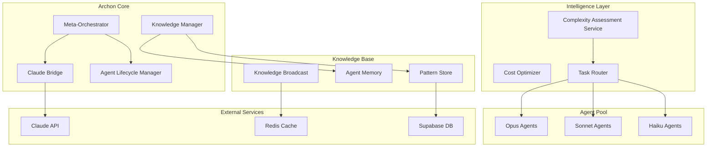

# Product Requirements Document (PRD)
# Archon 3.0: Intelligence-Tiered Adaptive Agent Management System

## Executive Summary

**Product Name:** Archon 3.0 - Adaptive Agent Orchestration Platform  
**Version:** 3.0.0  
**Date:** January 2025  
**Author:** Archon Development Team  
**Status:** Planning Phase

### Vision Statement
Transform Archon from a static agent orchestration tool into a self-organizing, learning ecosystem where Claude-powered agents dynamically spawn, evolve, and share knowledge to deliver optimal solutions while minimizing computational costs.

### Problem Statement
Current agent systems suffer from:
- **Knowledge Loss**: Agents are destroyed after tasks, losing valuable learnings
- **Cost Inefficiency**: All tasks use the same model tier regardless of complexity
- **No Evolution**: Agents don't improve over time or learn from past experiences
- **Static Configuration**: Agents can't adapt to changing project needs
- **Isolation**: Agents work in silos without knowledge sharing

### Solution Overview
Archon 3.0 introduces an intelligence-tiered, self-organizing agent management system that:
- Dynamically spawns project-specific agents based on detected needs
- Routes tasks to appropriate Claude model tiers (Opus/Sonnet/Haiku) based on complexity
- Maintains agent lifecycle states (Active/Idle/Hibernated) to preserve knowledge
- Enables real-time knowledge transfer between agents
- Builds project-specific knowledge bases that evolve over time

---

## 1. Product Goals & Objectives

### 1.1 Primary Goals
1. **Reduce API Costs by 70%** through intelligent model tier routing
2. **Improve Task Success Rate to >95%** through knowledge retention and learning
3. **Decrease Time-to-Solution by 50%** via agent knowledge reuse
4. **Enable True Autonomous Operation** with self-organizing agent swarms

### 1.2 Success Metrics
| Metric | Current | Target | Measurement Method |
|--------|---------|--------|-------------------|
| API Cost per Task | $0.15 | $0.045 | Cost tracking per execution |
| Task Success Rate | 75% | 95% | Success/failure tracking |
| Average Task Time | 120s | 60s | Execution time monitoring |
| Knowledge Reuse Rate | 0% | 80% | Pattern application tracking |
| Agent Efficiency Score | N/A | >0.9 | Performance/cost ratio |

### 1.3 Non-Goals (Out of Scope)
- Replacing human developers entirely
- Supporting non-Claude LLM models (initial release)
- Real-time collaborative editing between agents
- Visual agent workflow designer

---

## 2. User Personas & Use Cases

### 2.1 Primary Personas

#### **Persona 1: Enterprise Developer "Sarah"**
- **Role**: Senior Full-Stack Developer at Healthcare Startup
- **Needs**: Reliable, compliant code generation with consistent patterns
- **Pain Points**: Repetitive implementation of similar features, maintaining consistency
- **Value Prop**: Agents learn her codebase patterns and apply them automatically

#### **Persona 2: DevOps Engineer "Marcus"**
- **Role**: Platform Engineer managing 50+ microservices
- **Needs**: Automated infrastructure management and deployment optimization
- **Pain Points**: Manual configuration updates, deployment failures
- **Value Prop**: Specialized DevOps agents that understand his infrastructure

#### **Persona 3: Solo Developer "Alex"**
- **Role**: Indie developer building SaaS product
- **Needs**: Cost-effective AI assistance that learns project specifics
- **Pain Points**: High AI API costs, context switching between tasks
- **Value Prop**: Intelligent cost optimization with Haiku for simple tasks

### 2.2 Key Use Cases

#### **Use Case 1: First Project Activation**
```
GIVEN a developer activates Archon for a new project
WHEN Archon analyzes the codebase
THEN it should:
  1. Detect technology stack and architecture
  2. Identify needed specialized agents
  3. Spawn project-specific agents with appropriate model tiers
  4. Build initial knowledge base from existing code
  5. Report readiness with agent roster
```

#### **Use Case 2: Complex Feature Implementation**
```
GIVEN a developer requests a complex feature (e.g., "Add OAuth with MFA")
WHEN Archon receives the request
THEN it should:
  1. Assess task complexity (score: 0.9 - requires Opus)
  2. Check for idle OAuth-specialist agent or spawn new one
  3. Retrieve relevant patterns from knowledge base
  4. Execute with learning context
  5. Store successful patterns for future use
```

#### **Use Case 3: Routine Maintenance Task**
```
GIVEN a developer needs to remove console.log statements
WHEN Archon receives this simple request
THEN it should:
  1. Assess complexity (score: 0.2 - use Haiku)
  2. Activate or spawn simple-task agent
  3. Execute quickly with minimal cost
  4. Hibernate agent after completion
```

---

## 3. Functional Requirements

### 3.1 Agent Lifecycle Management

#### **F-ALM-001: Agent State Machine**
Agents must support the following states:
- **CREATED**: Initial spawn, loading knowledge
- **ACTIVE**: Currently executing tasks
- **IDLE**: Available for immediate task assignment (hot standby)
- **HIBERNATED**: Suspended to save resources, state preserved
- **ARCHIVED**: Deprecated but knowledge extracted and stored

**Acceptance Criteria:**
- State transitions logged with timestamps
- Automatic hibernation after 15 minutes idle
- Wake from hibernation < 100ms
- Knowledge preserved across all state transitions

#### **F-ALM-002: Dynamic Agent Spawning**
System must automatically spawn agents based on project needs:
```python
Required Capabilities:
- Analyze project to identify needed agent types
- Spawn agents with appropriate model tiers
- Inherit knowledge from similar existing agents
- Register in agent pool for reuse
```

#### **F-ALM-003: Agent Pool Management**
Maintain optimal agent pool size:
- Maximum active agents per tier: Opus(2), Sonnet(10), Haiku(50)
- Automatic resource optimization every 5 minutes
- Hibernation of idle agents
- Archival of unused agents after 30 days

### 3.2 Intelligence Tier Routing

#### **F-ITR-001: Task Complexity Assessment**
Automatically evaluate task complexity (0.0-1.0 scale):

| Complexity Score | Model Tier | Use Cases |
|-----------------|------------|-----------|
| 0.8 - 1.0 | Claude Opus | Architecture design, security analysis, complex debugging |
| 0.4 - 0.79 | Claude Sonnet | Feature implementation, testing, refactoring |
| 0.0 - 0.39 | Claude Haiku | Formatting, simple fixes, documentation |

**Assessment Factors:**
```python
complexity_factors = {
    "requires_architecture_decisions": +0.3,
    "involves_security_compliance": +0.25,
    "cross_system_integration": +0.2,
    "creative_problem_solving": +0.15,
    "simple_text_manipulation": -0.4,
    "formatting_only": -0.5
}
```

#### **F-ITR-002: Cost Optimization Engine**
Track and optimize costs in real-time:
- Cost per task tracking
- Budget alerts and limits
- Automatic tier downgrade for budget constraints
- ROI calculation per agent

### 3.3 Knowledge Management System

#### **F-KMS-001: Knowledge Storage Architecture**
Multi-layer knowledge storage:
```
/archon/knowledge-base/{project-id}/
├── patterns/           # Discovered code patterns
├── decisions/          # Architectural decisions
├── failures/           # What didn't work (anti-patterns)
├── optimizations/      # Performance improvements
├── relationships/      # Component interactions
└── agent-memory/       # Individual agent memories
```

#### **F-KMS-002: Knowledge Transfer Protocol**
Enable knowledge sharing between agents:
- **Synchronous Transfer**: Direct agent-to-agent for critical knowledge
- **Asynchronous Broadcast**: Publish discoveries to relevant agents
- **Inheritance**: New agents inherit from parent agents
- **Cross-Project Learning**: Share general patterns across projects

#### **F-KMS-003: Knowledge Evolution**
Implement confidence-based knowledge evolution:
```python
pattern_confidence = {
    "initial": 0.5,
    "after_success": confidence * 1.1 (max 0.99),
    "after_failure": confidence * 0.9 (min 0.1),
    "promotion_threshold": 0.8,  # Becomes "stable" pattern
    "demotion_threshold": 0.3   # Marked for review
}
```

### 3.4 Project-Specific Agent Creation

#### **F-PSA-001: Project Analysis**
On first activation, analyze project comprehensively:
- Technology stack detection
- Architecture pattern identification
- Domain-specific requirements discovery
- Compliance needs assessment
- Performance requirements extraction

#### **F-PSA-002: Agent Swarm Generation**
Create specialized agents based on analysis:
```python
Example for Healthcare Project:
- healthcare-compliance-agent (Opus)
- patient-data-handler (Opus)
- appointment-scheduler (Sonnet)
- form-validator (Sonnet)
- code-formatter (Haiku)
- import-organizer (Haiku)
```

#### **F-PSA-003: Agent Health Monitoring**
Continuous monitoring of agent performance:
- Success rate tracking
- Execution time analysis
- Cost per task calculation
- Knowledge contribution metrics
- Automatic retraining triggers

### 3.5 Real-Time Collaboration

#### **F-RTC-001: Shared Context**
Agents working on related tasks share context:
```python
shared_context = {
    "task_id": "implement-auth-system",
    "discoveries": [],      # Real-time updates
    "blockers": [],        # Issues found
    "patterns": [],        # Successful approaches
    "participants": []     # Active agents
}
```

#### **F-RTC-002: Knowledge Broadcasting**
Implement pub/sub for knowledge sharing:
- Redis/WebSocket for real-time updates
- Topic-based subscriptions
- Priority levels for critical knowledge
- Conflict resolution for contradictory patterns

---

## 4. Technical Architecture

### 4.1 System Components



### 4.2 Data Models

#### **Agent Model**
```typescript
interface Agent {
    id: string;
    project_id: string;
    name: string;
    type: AgentType;
    model_tier: 'opus' | 'sonnet' | 'haiku';
    state: 'created' | 'active' | 'idle' | 'hibernated' | 'archived';
    memory: AgentMemory;
    performance_metrics: PerformanceMetrics;
    knowledge_items: number;
    created_at: Date;
    last_active: Date;
    total_tasks: number;
    success_rate: number;
}
```

#### **Knowledge Item Model**
```typescript
interface KnowledgeItem {
    id: string;
    agent_id: string;
    project_id: string;
    type: 'pattern' | 'decision' | 'failure' | 'optimization';
    content: any;
    confidence: number;
    usage_count: number;
    success_count: number;
    failure_count: number;
    created_at: Date;
    last_used: Date;
    metadata: Record<string, any>;
}
```

### 4.3 API Specifications

#### **Agent Management API**
```typescript
POST   /api/agents/spawn
GET    /api/agents/{project_id}
PUT    /api/agents/{agent_id}/state
DELETE /api/agents/{agent_id}/archive
GET    /api/agents/{agent_id}/performance

POST   /api/tasks/submit
GET    /api/tasks/{task_id}/status
POST   /api/tasks/complexity-assessment

GET    /api/knowledge/{project_id}
POST   /api/knowledge/store
PUT    /api/knowledge/{item_id}/reinforce
POST   /api/knowledge/transfer
```

---

## 5. Implementation Phases

### Phase 1: Foundation (Weeks 1-3)
**Goal**: Core infrastructure and Claude Bridge

**Deliverables**:
- [ ] Claude Bridge with multi-tier support
- [ ] Basic agent lifecycle management
- [ ] Task complexity assessment engine
- [ ] Database schema implementation
- [ ] Basic cost tracking

**Success Criteria**:
- Successfully route tasks to different Claude tiers
- Agent state persistence working
- Complexity assessment accuracy >80%

### Phase 2: Knowledge System (Weeks 4-6)
**Goal**: Implement knowledge storage and retrieval

**Deliverables**:
- [ ] Knowledge storage architecture
- [ ] Pattern extraction and storage
- [ ] Knowledge retrieval and search
- [ ] Confidence scoring system
- [ ] Basic knowledge evolution

**Success Criteria**:
- Store and retrieve patterns successfully
- Knowledge search returning relevant results
- Confidence scores updating correctly

### Phase 3: Agent Intelligence (Weeks 7-9)
**Goal**: Smart agent spawning and management

**Deliverables**:
- [ ] Project analysis system
- [ ] Dynamic agent spawning
- [ ] Agent pool optimization
- [ ] Performance monitoring
- [ ] Agent hibernation/wake system

**Success Criteria**:
- Agents spawn based on project needs
- Hibernation reducing resource usage >60%
- Performance metrics tracking accurately

### Phase 4: Knowledge Transfer (Weeks 10-12)
**Goal**: Enable agent collaboration and learning

**Deliverables**:
- [ ] Real-time knowledge broadcasting
- [ ] Agent-to-agent knowledge transfer
- [ ] Knowledge inheritance for new agents
- [ ] Shared context implementation
- [ ] Cross-project pattern sharing

**Success Criteria**:
- Agents successfully sharing discoveries
- New agents inheriting relevant knowledge
- Knowledge reuse rate >70%

### Phase 5: Optimization & Polish (Weeks 13-14)
**Goal**: Performance optimization and production readiness

**Deliverables**:
- [ ] Performance optimization
- [ ] Cost optimization algorithms
- [ ] Monitoring and alerting
- [ ] Documentation
- [ ] Migration tools from v2

**Success Criteria**:
- API response times <200ms
- Cost reduction >70% demonstrated
- Zero critical bugs
- Complete documentation

---

## 6. Testing Strategy

### 6.1 Test Coverage Requirements
- Unit Tests: >95% coverage
- Integration Tests: All API endpoints
- E2E Tests: Critical user journeys
- Performance Tests: Load and stress testing
- Cost Tests: Verify optimization algorithms

### 6.2 Test Scenarios

#### **Scenario 1: Agent Lifecycle**
```python
def test_agent_lifecycle():
    # Create agent
    agent = spawn_agent("test-project", "code-implementer", "sonnet")
    assert agent.state == "created"
    
    # Execute task
    agent.execute_task("implement feature")
    assert agent.state == "active"
    
    # Wait for idle
    time.sleep(task_completion)
    assert agent.state == "idle"
    
    # Auto-hibernation
    time.sleep(15 * 60)
    assert agent.state == "hibernated"
    
    # Wake agent
    agent.wake()
    assert agent.state == "idle"
    assert agent.memory_intact()
```

#### **Scenario 2: Knowledge Transfer**
```python
def test_knowledge_transfer():
    # Agent A discovers pattern
    agent_a = spawn_agent("project", "developer", "sonnet")
    pattern = agent_a.discover_pattern("api_optimization")
    
    # Agent B receives pattern
    agent_b = spawn_agent("project", "developer", "sonnet")
    assert pattern in agent_b.available_patterns
    
    # Confidence increases with success
    agent_b.apply_pattern(pattern, success=True)
    assert pattern.confidence > initial_confidence
```

---

## 7. Security & Compliance

### 7.1 Security Requirements
- **API Key Management**: Secure storage with encryption at rest
- **Agent Isolation**: Agents operate in sandboxed environments
- **Knowledge Encryption**: Sensitive patterns encrypted in storage
- **Access Control**: Project-level access controls
- **Audit Logging**: All agent actions logged for compliance

### 7.2 Data Privacy
- **PII Protection**: Automatic PII detection and masking
- **Knowledge Sanitization**: Remove sensitive data before sharing
- **Project Isolation**: Strict project boundary enforcement
- **GDPR Compliance**: Right to deletion, data portability
- **Healthcare Compliance**: HIPAA-compliant for healthcare projects

---

## 8. Performance Requirements

### 8.1 Response Time SLAs
| Operation | P50 | P95 | P99 |
|-----------|-----|-----|-----|
| Task Submission | 50ms | 100ms | 200ms |
| Agent Spawn | 500ms | 1s | 2s |
| Agent Wake | 50ms | 100ms | 200ms |
| Knowledge Search | 100ms | 200ms | 500ms |
| Pattern Storage | 50ms | 100ms | 200ms |

### 8.2 Scalability Targets
- Concurrent Projects: 10,000
- Active Agents: 1,000 per project
- Knowledge Items: 1M per project
- Requests/Second: 10,000
- Knowledge Broadcasts/Second: 100,000

---

## 9. Migration Strategy

### 9.1 From Archon 2.0 to 3.0
```python
migration_steps = {
    1: "Export existing knowledge base",
    2: "Convert to new schema format",
    3: "Initialize agent pool from existing patterns",
    4: "Import project configurations",
    5: "Validate knowledge integrity",
    6: "Enable new features progressively"
}
```

### 9.2 Rollback Plan
- Maintain Archon 2.0 in parallel for 30 days
- One-click rollback to previous version
- Knowledge export in portable format
- Agent state snapshots for recovery

---

## 10. Success Metrics & KPIs

### 10.1 Launch Success Criteria (Month 1)
- [ ] 100 projects migrated successfully
- [ ] Cost reduction >50% demonstrated
- [ ] Zero data loss during migration
- [ ] Agent success rate >90%
- [ ] User satisfaction score >4.5/5

### 10.2 Long-term Success Metrics (Month 6)
- [ ] 10,000 active projects
- [ ] Average cost reduction 70%
- [ ] Knowledge reuse rate >80%
- [ ] Agent efficiency score >0.9
- [ ] Platform uptime >99.9%

---

## 11. Risks & Mitigations

| Risk | Probability | Impact | Mitigation |
|------|------------|--------|------------|
| Claude API changes | Medium | High | Abstract API layer, version pinning |
| Knowledge corruption | Low | High | Redundant storage, validation checks |
| Cost overruns | Medium | Medium | Budget limits, automatic downgrades |
| Agent sprawl | Medium | Low | Automatic cleanup, resource limits |
| Knowledge conflicts | Medium | Medium | Confidence scoring, conflict resolution |

---

## 12. Future Enhancements (Post-Launch)

### Version 3.1 (Q2 2025)
- Visual agent workflow designer
- Multi-LLM support (GPT, Gemini)
- Agent marketplace for sharing
- Advanced analytics dashboard

### Version 3.2 (Q3 2025)
- Real-time collaborative editing
- Agent skill certification system
- Automated agent training pipelines
- Cross-organization knowledge sharing

### Version 4.0 (Q4 2025)
- Fully autonomous project management
- Self-healing code systems
- Predictive agent spawning
- Natural language agent programming

---

## Appendices

### A. Glossary
- **Agent**: An AI-powered entity specialized for specific tasks
- **Hibernation**: Suspended state preserving agent memory
- **Knowledge Item**: A learned pattern, decision, or optimization
- **Model Tier**: Claude Opus/Sonnet/Haiku capability levels
- **Swarm**: Collection of agents working on related tasks

### B. References
- Claude API Documentation
- Archon 2.0 Architecture Docs
- Knowledge Graph Best Practices
- Agent-Based Systems Research

### C. Approval & Sign-off

| Role | Name | Signature | Date |
|------|------|-----------|------|
| Product Owner | | | |
| Tech Lead | | | |
| Engineering Manager | | | |
| QA Lead | | | |

---

**Document Version**: 1.0.0  
**Last Updated**: January 2025  
**Next Review**: February 2025