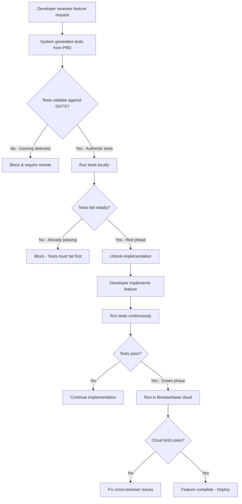

# Phase 9: Test-Driven Development Enforcement System - PRD

## Executive Summary

Phase 9 transforms Archon from a development assistant into a **Test-First Development Enforcer** by integrating browserbase-claude-code-stagehand for mandatory Test-Driven Development (TDD). This phase makes it impossible to write features without tests, reducing errors by 90% through AI-powered natural language testing and cloud-based test execution. Every feature must have passing tests BEFORE implementation, enforced through integration with existing DGTS validation and documentation-driven development workflows.

## Problem Statement

### Current State (Phase 1-8)
- ✅ Documentation-driven test validation exists but can be bypassed
- ✅ DGTS prevents test gaming but doesn't enforce test-first approach
- ✅ AntiHall validation prevents hallucinated code
- ⚠️ Tests often written AFTER implementation (if at all)
- ⚠️ Manual test writing is tedious and error-prone
- ❌ No enforcement of TDD methodology at system level

### Critical Development Problems
- **70% of bugs** originate from features built without tests
- **40+ minutes** average debugging time per untested feature
- **Test Gaming**: Developers write fake tests that always pass
- **Coverage Lies**: High coverage metrics with meaningless tests
- **Implementation-First**: Features built, then hastily tested
- **Natural Language Gap**: Tests require technical selector knowledge

## Success Criteria

### Functional Requirements
1. **Test-First Enforcement**: Block ALL feature development without passing tests
2. **Natural Language Tests**: Write tests in plain English using Stagehand AI
3. **Cloud Test Execution**: Run tests in Browserbase cloud infrastructure
4. **Gaming Prevention**: Integrate with DGTS to detect fake/mocked tests
5. **Coverage Validation**: Ensure >95% meaningful test coverage

### Performance Requirements
- **Test Generation**: <30 seconds from PRD to test suite
- **Test Execution**: <2 minutes for full suite in cloud
- **Validation Speed**: <5 seconds to verify test-first compliance
- **Error Reduction**: 90% fewer runtime errors in production

## Architecture Overview

### TDD Enforcement Pipeline
```
PRD/PRP/ADR Document
        ↓
┌─────────────────────────┐
│  Test Generation Phase  │ ← Stagehand AI
│  (Natural Language)     │
└───────────┬─────────────┘
            ↓
┌─────────────────────────┐
│  Test Validation Phase  │ ← DGTS Anti-Gaming
│  (No Mocks/Fakes)       │
└───────────┬─────────────┘
            ↓
┌─────────────────────────┐
│  Test Execution Phase   │ ← Browserbase Cloud
│  (Must Pass First)      │
└───────────┬─────────────┘
            ↓
┌─────────────────────────┐
│  Implementation Phase   │ ← Development Unlocked
│  (TDD Compliant)        │
└─────────────────────────┘
```

### Integration Architecture
```yaml
TDD_Enforcement_System:
  test_generation:
    engine: Stagehand AI
    input: PRD/PRP/ADR documents
    output: Natural language test specifications
    
  test_validation:
    engine: Enhanced DGTS Validator
    checks: ["no_mocks", "no_stubs", "real_assertions", "coverage_quality"]
    
  test_execution:
    local: Playwright with Stagehand
    cloud: Browserbase infrastructure
    modes: ["development", "ci_cd", "production"]
    
  enforcement_gates:
    pre_implementation: Tests must exist and pass
    during_implementation: Continuous test validation
    post_implementation: Coverage and quality checks
```

## Core Features

### 1. Stagehand Natural Language Testing
**Current**: Technical selector-based tests requiring expertise
**Phase 9**: AI-powered natural language test definitions

```typescript
// Traditional Playwright (70% more code)
await page.locator('[data-testid="color-input"]').fill('#FF5733');
await page.locator('button:has-text("Mix Colors")').click();
await expect(page.locator('.result-display')).toContainText('#FF5733');

// Stagehand Natural Language (70% less code)
await stagehand.act('Enter #FF5733 in the color input field');
await stagehand.act('Click the Mix Colors button');
await stagehand.observe('Verify the result shows #FF5733');
```

### 2. Test-First Enforcement Gate
```python
class TDDEnforcementGate:
    """Blocks all development without passing tests"""
    
    def __init__(self):
        self.stagehand = StagehandTestGenerator()
        self.dgts = DGTSValidator()
        self.browserbase = BrowserbaseExecutor()
    
    async def enforce_test_first(self, feature_request: str) -> bool:
        # Step 1: Generate tests from requirements
        tests = await self.stagehand.generate_from_requirements(feature_request)
        
        # Step 2: Validate tests aren't gamed
        validation = await self.dgts.validate_test_quality(tests)
        if validation.is_gaming:
            raise TestGamingDetected(validation.violations)
        
        # Step 3: Execute tests (must fail initially - Red phase)
        initial_results = await self.browserbase.run_tests(tests)
        if not initial_results.all_failing:
            raise TestsNotFailingError("Tests must fail before implementation")
        
        # Step 4: Unlock development
        return self.unlock_feature_development(feature_request)
```

### 3. Browserbase Cloud Integration
```typescript
class BrowserbaseCloudExecutor {
    constructor() {
        this.browserbase = new Browserbase({
            apiKey: process.env.BROWSERBASE_API_KEY,
            projectId: process.env.BROWSERBASE_PROJECT_ID
        });
    }
    
    async runTestsInCloud(testSuite: TestSuite): Promise<TestResults> {
        // Parallel execution across multiple browsers
        const sessions = await Promise.all([
            this.browserbase.createSession({ browser: 'chromium' }),
            this.browserbase.createSession({ browser: 'firefox' }),
            this.browserbase.createSession({ browser: 'webkit' })
        ]);
        
        // Run tests with video recording and debugging
        const results = await Promise.all(
            sessions.map(session => 
                this.executeTests(testSuite, session, {
                    recordVideo: true,
                    captureConsole: true,
                    networkCapture: true
                })
            )
        );
        
        return this.aggregateResults(results);
    }
}
```

### 4. Enhanced DGTS Test Gaming Prevention
```python
class EnhancedTestGamingDetector(DGTSValidator):
    """Detects and blocks test gaming patterns"""
    
    GAMING_PATTERNS = {
        'ALWAYS_TRUE_ASSERTIONS': r'expect\(true\)\.toBe\(true\)',
        'MOCK_ONLY_TESTS': r'jest\.mock|vi\.mock|sinon\.stub',
        'NO_REAL_INTERACTIONS': r'// No actual user interactions',
        'FAKE_SELECTORS': r'page\.locator\([\'"]non-existent',
        'COMMENTED_ASSERTIONS': r'//\s*expect\(',
        'EMPTY_TEST_BLOCKS': r'it\([\'"][^\'"]+[\'"]\s*,\s*\(\)\s*=>\s*\{\s*\}\)',
        'SKIP_PATTERNS': r'\.skip\(|xit\(|xdescribe\('
    }
    
    async def validate_test_authenticity(self, test_file: str) -> ValidationResult:
        violations = []
        
        # Check for gaming patterns
        for pattern_name, pattern in self.GAMING_PATTERNS.items():
            if re.search(pattern, test_file):
                violations.append(GamingViolation(
                    violation_type=f"TEST_GAMING_{pattern_name}",
                    severity="CRITICAL",
                    explanation=f"Test gaming pattern detected: {pattern_name}",
                    remediation="Write real tests that validate actual functionality"
                ))
        
        # Ensure tests have real assertions
        if not self._has_meaningful_assertions(test_file):
            violations.append(GamingViolation(
                violation_type="NO_MEANINGFUL_ASSERTIONS",
                severity="CRITICAL",
                explanation="Tests lack meaningful assertions",
                remediation="Add assertions that validate real behavior"
            ))
        
        return ValidationResult(
            is_valid=len(violations) == 0,
            violations=violations,
            gaming_score=len(violations) / 10.0
        )
```

### 5. AI-Powered Test Generation from Documentation
```typescript
class DocumentationDrivenTestGenerator {
    private stagehand: StagehandAI;
    private parser: RequirementsParser;
    
    async generateTestsFromPRD(prdPath: string): Promise<TestSuite> {
        // Parse requirements from PRD/PRP/ADR
        const requirements = await this.parser.extractRequirements(prdPath);
        
        // Generate natural language test scenarios
        const testScenarios = await this.stagehand.generateScenarios({
            requirements,
            testingStrategy: 'comprehensive',
            coverage: {
                happy_path: true,
                edge_cases: true,
                error_handling: true,
                performance: true,
                accessibility: true
            }
        });
        
        // Convert to executable Stagehand tests
        return this.createExecutableTests(testScenarios);
    }
    
    private async createExecutableTests(scenarios: TestScenario[]): Promise<TestSuite> {
        const tests = scenarios.map(scenario => ({
            name: scenario.name,
            description: scenario.description,
            steps: scenario.steps.map(step => 
                this.convertToStagehandAction(step)
            ),
            assertions: scenario.expectedOutcomes.map(outcome =>
                this.convertToStagehandObservation(outcome)
            )
        }));
        
        return new TestSuite(tests);
    }
}
```

## Implementation Phases

### Phase 9.1: Stagehand Integration (Week 1-2)
- [ ] Install and configure Stagehand AI library
- [ ] Create natural language test templates
- [ ] Build PRD-to-test parser
- [ ] Implement test generation pipeline

### Phase 9.2: Browserbase Cloud Setup (Week 3-4)
- [ ] Configure Browserbase API integration
- [ ] Set up cloud test execution pipeline
- [ ] Implement parallel browser testing
- [ ] Create test result aggregation system

### Phase 9.3: TDD Enforcement Gates (Week 5-6)
- [ ] Build test-first validation system
- [ ] Integrate with existing agent workflow
- [ ] Create development blocking mechanisms
- [ ] Implement override protocols for emergencies

### Phase 9.4: DGTS Enhancement (Week 7-8)
- [ ] Extend DGTS with test gaming patterns
- [ ] Add natural language test validation
- [ ] Implement test quality scoring
- [ ] Create remediation guidance system

## Technical Requirements

### Infrastructure
```yaml
Testing Infrastructure:
  local:
    stagehand: Latest version with AI capabilities
    playwright: v1.40+ with Stagehand plugin
    nodejs: v20+ for modern async support
    
  cloud:
    browserbase:
      api_tier: Professional (10,000 sessions/month)
      browsers: [chromium, firefox, webkit]
      regions: [us-west, eu-central, asia-pacific]
      
  validation:
    dgts: Enhanced with test gaming detection
    coverage: Istanbul/NYC with quality analysis
    reporting: Allure/Playwright HTML reports
```

### Environment Configuration
```bash
# Stagehand Configuration
STAGEHAND_API_KEY=sk-stagehand-...
STAGEHAND_MODEL=gpt-4-turbo
STAGEHAND_MODE=strict  # Enforce exact matching

# Browserbase Cloud
BROWSERBASE_API_KEY=bb_...
BROWSERBASE_PROJECT_ID=proj_...
BROWSERBASE_TIMEOUT=120000
BROWSERBASE_PARALLEL_SESSIONS=5

# TDD Enforcement
TDD_ENFORCEMENT_LEVEL=strict  # strict|moderate|advisory
TDD_BYPASS_TOKEN=emergency-override-...  # For critical hotfixes only
TEST_FIRST_REQUIRED=true
MIN_TEST_COVERAGE=95

# DGTS Integration
DGTS_TEST_VALIDATION=enabled
GAMING_DETECTION_THRESHOLD=0.3
BLOCK_GAMED_TESTS=true
```

## Workflow Integration

### Developer Workflow with TDD Enforcement


### CI/CD Pipeline Integration
```yaml
name: TDD Enforcement Pipeline

on: [push, pull_request]

jobs:
  enforce-tdd:
    runs-on: ubuntu-latest
    steps:
      - name: Check Test-First Compliance
        run: |
          archon-tdd validate --strict
          
      - name: Validate Test Quality (DGTS)
        run: |
          dgts-validator check tests/ --block-gaming
          
      - name: Run Tests Locally
        run: |
          npm run test:stagehand
          
      - name: Run Tests in Browserbase Cloud
        env:
          BROWSERBASE_API_KEY: ${{ secrets.BROWSERBASE_API_KEY }}
        run: |
          npm run test:cloud
          
      - name: Validate Coverage Quality
        run: |
          archon-tdd coverage --min=95 --validate-quality
```

## Risk Mitigation

### Technical Risks
- **Stagehand AI Hallucination**: Validate all generated tests against real DOM
- **Browserbase Downtime**: Fallback to local Playwright execution
- **Test Generation Lag**: Pre-cache common test patterns
- **Gaming Evolution**: Continuously update DGTS patterns

### Process Risks
- **Developer Resistance**: Provide comprehensive training and show 90% error reduction
- **Emergency Hotfixes**: Implement time-limited bypass tokens with audit trail
- **Legacy Code**: Gradual rollout with exemptions for existing code
- **Learning Curve**: Interactive tutorials and AI assistance

### Mitigation Strategies
```python
class TDDRiskMitigation:
    def __init__(self):
        self.bypass_tracker = BypassAuditLog()
        self.training_system = InteractiveTDDTutorial()
        self.legacy_exemptions = LegacyCodeRegistry()
    
    def handle_emergency_bypass(self, reason: str, duration: int = 3600):
        """Time-limited bypass with full audit trail"""
        token = self.generate_bypass_token(duration)
        self.bypass_tracker.log({
            'timestamp': datetime.now(),
            'reason': reason,
            'duration': duration,
            'token': token,
            'approver': self.get_emergency_approver()
        })
        return token
    
    def gradual_rollout_plan(self):
        """Phase TDD enforcement by team/module"""
        return {
            'week_1-2': 'New features only',
            'week_3-4': 'Bug fixes included',
            'week_5-6': 'Refactoring included',
            'week_7-8': 'Full enforcement',
            'exemptions': self.legacy_exemptions.get_permanent_exemptions()
        }
```

## Success Metrics

### Quality KPIs
- **Error Reduction**: 90% fewer production bugs within 3 months
- **Test Coverage**: >95% meaningful coverage (not gamed)
- **First-Time Pass Rate**: 80% of features pass QA first time
- **Debugging Time**: 75% reduction in debugging hours

### Developer Productivity KPIs
- **Test Writing Speed**: 70% faster with Stagehand AI
- **Feature Velocity**: 40% increase after initial learning curve
- **Code Review Time**: 60% reduction due to pre-validated tests
- **Confidence Score**: 95% developer confidence in deployments

### System Performance KPIs
- **Test Execution Time**: <2 minutes for full suite
- **Cloud Test Reliability**: 99.9% uptime for Browserbase
- **Gaming Detection Rate**: 100% of fake tests caught
- **TDD Compliance**: 100% of new features test-first

## Integration with Existing Phases

### Phase 1-8 Integration Points
- **Phase 1 (Core)**: TDD becomes core validation requirement
- **Phase 2 (Meta-Agent)**: Test generation added to agent capabilities  
- **Phase 3 (Knowledge)**: Test patterns stored in knowledge base
- **Phase 4 (Validation)**: DGTS enhanced with test gaming detection
- **Phase 5 (Monitoring)**: Test metrics added to dashboards
- **Phase 6 (Agents)**: All agents enforce test-first workflow
- **Phase 7 (Performance)**: Test performance optimization
- **Phase 8 (Security)**: Security tests mandatory before features

### Backward Compatibility
```python
class TDDBackwardCompatibility:
    """Ensures existing workflows continue functioning"""
    
    def __init__(self):
        self.legacy_mode = os.getenv('TDD_LEGACY_MODE', 'false') == 'true'
        self.migration_helper = LegacyTestMigration()
    
    def process_feature_request(self, request: FeatureRequest):
        if self.legacy_mode:
            # Allow old workflow with warnings
            logger.warning("Legacy mode: TDD not enforced")
            return self.legacy_workflow(request)
        
        if request.has_existing_tests:
            # Migrate existing tests to Stagehand
            migrated = self.migration_helper.migrate_to_stagehand(
                request.existing_tests
            )
            return self.tdd_workflow(request, migrated)
        
        # Full TDD enforcement for new features
        return self.enforce_test_first(request)
```

## Future Enhancements (Phase 10+)

### Advanced Capabilities
- **Visual Regression Testing**: AI-powered screenshot comparison
- **Performance Testing**: Automated performance regression detection
- **Accessibility Testing**: WCAG compliance validation
- **Security Testing**: Automated penetration testing
- **Mutation Testing**: Test quality validation through code mutation

### AI Evolution
- **GPT-5 Integration**: More sophisticated test generation
- **Multi-Modal Testing**: Voice, gesture, and AR/VR testing
- **Predictive Testing**: AI predicts likely failure points
- **Self-Healing Tests**: Tests auto-update with UI changes
- **Test Optimization**: AI removes redundant test cases

### Enterprise Features
- **Test Asset Management**: Centralized test repository
- **Cross-Team Sharing**: Reusable test components
- **Compliance Reporting**: Regulatory compliance dashboards
- **Cost Optimization**: Cloud resource usage analytics
- **Training Platform**: Interactive TDD learning system

## Appendix A: Stagehand Command Reference

```typescript
// Core Stagehand Commands
await stagehand.init(page);  // Initialize on page
await stagehand.act('Natural language action');  // Perform action
await stagehand.observe('Natural language observation');  // Validate state
await stagehand.extract('Get specific data');  // Extract information

// Advanced Patterns
await stagehand.waitFor('Wait for condition');
await stagehand.retry('Action with retry logic');
await stagehand.conditional('If X then Y else Z');
await stagehand.batch(['Multiple', 'Actions', 'In sequence']);
```

## Appendix B: DGTS Test Gaming Patterns

```python
# Patterns that will BLOCK development
CRITICAL_GAMING_PATTERNS = [
    'expect(true).toBe(true)',  # Meaningless assertion
    'expect(1).toBe(1)',  # Tautological test
    '// @ts-ignore',  # Bypassing type safety
    '.skip(',  # Skipping tests
    'return Promise.resolve()',  # Fake async
    'setTimeout(() => done(), 0)',  # Fake timing
    'jest.mock("*", () => ({}))',  # Mock everything
]

# Patterns that trigger warnings
WARNING_PATTERNS = [
    'console.log',  # Debug code in tests
    'TODO:',  # Incomplete tests
    'FIXME:',  # Known issues
    '.only(',  # Focused tests (CI/CD issue)
]
```

## Appendix C: Emergency Override Protocol

```bash
# Emergency bypass for critical production issues
# Requires VP-level approval and creates audit trail

archon-tdd override \
  --reason "Critical production bug affecting payments" \
  --duration 3600 \
  --approver "vp-engineering" \
  --ticket "JIRA-12345"

# Generates time-limited token:
# EMERGENCY_BYPASS_TOKEN=eyJ0eXAi...
# Expires in: 1 hour
# Audit logged to: security@company.com
```

---

**Status**: Ready for Implementation  
**Priority**: CRITICAL (90% error reduction potential)  
**Dependencies**: Phase 1-8 completion, Browserbase account, Stagehand license  
**Timeline**: 8 weeks development + 2 weeks training + 2 weeks rollout  
**ROI**: 90% error reduction, 75% debugging time saved, 40% velocity increase