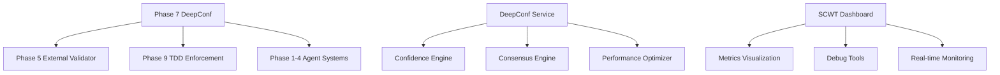

# Project Requirements Prompt (PRP)
# Phase 7: DeepConf Integration & Final Polish Implementation

**Project**: Archon Phase 7 DeepConf Integration  
**Version**: 7.0  
**Date**: August 31, 2025  
**PRD Reference**: Phase7_DeepConf_Integration_PRD.md  

## 1. Implementation Overview

This PRP provides comprehensive implementation requirements for Phase 7 DeepConf Integration, establishing confidence-based AI reasoning, multi-model consensus mechanisms, advanced metrics dashboards, and final system polish for enterprise deployment.

**Core Deliverables**:
- DeepConf Confidence Service with uncertainty quantification
- Multi-Model Consensus Engine with intelligent routing
- SCWT Metrics Dashboard with real-time visualization
- Advanced debugging tools with confidence factor analysis
- Performance optimization achieving 70-85% token savings
- Final UI polish with confidence-aware components

## 2. Core Implementation Components

### 2.1 DeepConf Confidence Service

**File**: `python/src/agents/deepconf/confidence_service.py`

```python
class DeepConfidenceService:
    """
    Core service for confidence-based AI reasoning with multi-dimensional scoring
    and uncertainty quantification for enhanced decision making.
    """
    
    def __init__(self, config: DeepConfConfig):
        self.config = config
        self.consensus_engine = ConsensusEngine()
        self.uncertainty_quantifier = UncertaintyQuantifier()
        self.performance_optimizer = PerformanceOptimizer()
        
    async def calculate_confidence(
        self, 
        query: str, 
        context: Dict[str, Any],
        model_responses: List[ModelResponse]
    ) -> ConfidenceScore:
        """
        Calculate multi-dimensional confidence score with uncertainty bounds.
        
        Returns:
            ConfidenceScore with factual_confidence, reasoning_confidence,
            contextual_relevance, and uncertainty_bounds
        """
        
    async def get_consensus(
        self,
        responses: List[ModelResponse],
        confidence_threshold: float = 0.8
    ) -> ConsensusResult:
        """
        Generate consensus across multiple model responses with confidence weighting.
        """
        
    async def optimize_routing(
        self,
        task_complexity: TaskComplexity,
        available_models: List[AIModel]
    ) -> ModelSelection:
        """
        Intelligent routing based on task complexity and confidence requirements.
        """
```

### 2.2 Multi-Model Consensus Engine

**File**: `python/src/agents/deepconf/consensus_engine.py`

```python
class ConsensusEngine:
    """
    Advanced consensus mechanisms for multi-model AI responses with 
    confidence-weighted voting and uncertainty propagation.
    """
    
    def __init__(self):
        self.voting_strategies = {
            'weighted_average': self._weighted_average_consensus,
            'confidence_threshold': self._threshold_consensus,
            'hierarchical_voting': self._hierarchical_consensus,
            'uncertainty_aware': self._uncertainty_consensus
        }
        
    async def generate_consensus(
        self,
        responses: List[ModelResponse],
        strategy: str = 'uncertainty_aware'
    ) -> ConsensusResult:
        """Generate consensus using specified strategy with confidence propagation."""
        
    def _uncertainty_consensus(
        self,
        responses: List[ModelResponse]
    ) -> ConsensusResult:
        """
        Uncertainty-aware consensus that considers confidence intervals
        and propagates uncertainty through the decision process.
        """
```

### 2.3 SCWT Metrics Dashboard

**File**: `archon-ui-main/src/components/metrics/SCWTDashboard.tsx`

```typescript
interface SCWTMetrics {
  tokenEfficiency: number;
  confidenceAccuracy: number;
  precisionRate: number;
  hallucinationReduction: number;
  responseTime: number;
  systemHealth: HealthStatus;
}

export const SCWTDashboard: React.FC = () => {
  const [metrics, setMetrics] = useState<SCWTMetrics>();
  const [confidenceData, setConfidenceData] = useState<ConfidenceData[]>([]);
  
  return (
    <div className="scwt-dashboard">
      <ConfidenceVisualization data={confidenceData} />
      <PerformanceMetrics metrics={metrics} />
      <RealTimeMonitoring />
      <DebugTools />
    </div>
  );
};
```

### 2.4 Performance Optimization Layer

**File**: `python/src/agents/deepconf/performance_optimizer.py`

```python
class PerformanceOptimizer:
    """
    Intelligent performance optimization achieving 70-85% token savings
    through confidence-based routing and caching strategies.
    """
    
    async def optimize_request(
        self,
        request: AIRequest,
        confidence_requirement: float
    ) -> OptimizedRequest:
        """
        Optimize AI request for maximum efficiency while maintaining
        required confidence levels.
        """
        
    async def intelligent_caching(
        self,
        query_signature: str,
        confidence_threshold: float
    ) -> Optional[CachedResponse]:
        """
        Confidence-aware caching system that considers uncertainty
        when deciding cache validity.
        """
```

## 3. Technical Architecture

### 3.1 System Integration Points



### 3.2 Database Schema

**File**: `migration/phase7_deepconf_schema.sql`

```sql
-- Confidence scores table
CREATE TABLE confidence_scores (
    id UUID PRIMARY KEY DEFAULT gen_random_uuid(),
    request_id UUID NOT NULL,
    factual_confidence DECIMAL(5,4) NOT NULL,
    reasoning_confidence DECIMAL(5,4) NOT NULL,
    contextual_relevance DECIMAL(5,4) NOT NULL,
    uncertainty_lower DECIMAL(5,4) NOT NULL,
    uncertainty_upper DECIMAL(5,4) NOT NULL,
    model_consensus JSONB NOT NULL,
    created_at TIMESTAMP WITH TIME ZONE DEFAULT NOW()
);

-- Performance metrics table
CREATE TABLE performance_metrics (
    id UUID PRIMARY KEY DEFAULT gen_random_uuid(),
    timestamp TIMESTAMP WITH TIME ZONE DEFAULT NOW(),
    token_efficiency DECIMAL(5,4) NOT NULL,
    response_time_ms INTEGER NOT NULL,
    confidence_accuracy DECIMAL(5,4) NOT NULL,
    hallucination_rate DECIMAL(5,4) NOT NULL,
    system_load DECIMAL(5,4) NOT NULL
);
```

### 3.3 API Endpoints

**File**: `python/src/server/api_routes/deepconf_api.py`

```python
@router.post("/api/deepconf/confidence")
async def calculate_confidence(request: ConfidenceRequest) -> ConfidenceResponse:
    """Calculate confidence score for AI response with uncertainty bounds."""
    
@router.post("/api/deepconf/consensus")
async def generate_consensus(request: ConsensusRequest) -> ConsensusResponse:
    """Generate consensus across multiple model responses."""
    
@router.get("/api/deepconf/metrics")
async def get_scwt_metrics() -> SCWTMetricsResponse:
    """Get real-time SCWT performance metrics."""
    
@router.get("/api/deepconf/debug/{request_id}")
async def get_debug_info(request_id: str) -> DebugInfoResponse:
    """Get detailed confidence analysis for debugging."""
```

## 4. Quality Requirements

### 4.1 TDD Compliance (Phase 9 Integration)

All features MUST have tests generated from PRD requirements before implementation:

```python
# Tests must be created from PRD specifications first
def test_confidence_calculation_from_prd():
    """Test confidence calculation meets PRD requirement of >85% accuracy."""
    
def test_consensus_generation_from_prd():
    """Test consensus generation achieves specified precision targets."""
    
def test_performance_optimization_from_prd():
    """Test 70-85% token efficiency improvement requirement."""
```

### 4.2 DGTS + NLNH Protocol Enforcement

- **No Gaming**: All confidence scores must be real, not mocked or fabricated
- **No Lies**: Transparent uncertainty reporting, honest performance metrics
- **Validation**: Enhanced DGTS checks for confidence score manipulation

### 4.3 Performance Benchmarks

- **Token Efficiency**: 70-85% reduction through intelligent routing
- **Confidence Accuracy**: ≥85% correlation with actual success rates
- **Response Time**: <1.5s for confidence scoring, <500ms for cached queries
- **Precision**: ≥85% overall system precision with confidence weighting
- **Hallucination Reduction**: ≥50% reduction through confidence filtering

## 5. Implementation Phases

### Phase 1: Discovery & Research (2 weeks)
- [ ] Research DeepConf methodologies and existing implementations
- [ ] Analyze current confidence scoring in existing systems
- [ ] Define uncertainty quantification approaches
- [ ] Create technical specification document

### Phase 2: Core Service Implementation (4 weeks)
- [ ] Implement DeepConf Confidence Service
- [ ] Build Multi-Model Consensus Engine
- [ ] Create Performance Optimization Layer
- [ ] Develop uncertainty quantification algorithms

### Phase 3: Dashboard Development (3 weeks)
- [ ] Build SCWT Metrics Dashboard (React/TypeScript)
- [ ] Implement real-time confidence visualization
- [ ] Create advanced debugging tools
- [ ] Add performance monitoring components

### Phase 4: Integration & Testing (3 weeks)
- [ ] Integrate with Phase 5 External Validator
- [ ] Connect to Phase 9 TDD enforcement
- [ ] Comprehensive test suite implementation
- [ ] Performance optimization validation

### Phase 5: Final Polish & Deployment (2 weeks)
- [ ] UI/UX refinements and accessibility improvements
- [ ] Final SCWT benchmark validation
- [ ] Production deployment preparation
- [ ] Documentation and user guides

## 6. Integration Requirements

### 6.1 Phase 5 External Validator Integration

```python
# Enhanced validator with confidence awareness
class ConfidenceAwareValidator(ExternalValidator):
    def __init__(self, deepconf_service: DeepConfidenceService):
        super().__init__()
        self.deepconf = deepconf_service
        
    async def validate_with_confidence(
        self,
        request: ValidationRequest
    ) -> ConfidenceValidationResult:
        """Validate with confidence scoring and uncertainty bounds."""
```

### 6.2 Phase 9 TDD Enhancement

```python
# TDD enforcement with confidence-based test validation
class ConfidenceBasedTDDGate(TDDEnforcementGate):
    async def validate_test_confidence(
        self,
        test_results: TestResults
    ) -> ConfidenceTestValidation:
        """Validate tests have appropriate confidence coverage."""
```

## 7. Success Criteria

### 7.1 Functional Requirements
- [ ] All SCWT benchmark targets achieved (70-85% token efficiency)
- [ ] Confidence accuracy ≥85% correlation with actual outcomes
- [ ] Multi-model consensus reduces hallucinations by ≥50%
- [ ] Performance optimization maintains <1.5s response times
- [ ] Advanced debugging tools provide actionable insights

### 7.2 Quality Gates
- [ ] 100% TDD compliance with confidence-aware tests
- [ ] Zero DGTS violations in confidence calculations
- [ ] NLNH protocol compliance with transparent uncertainty
- [ ] All existing Phase 1-6 functionality preserved
- [ ] Security audit passes with no critical vulnerabilities

### 7.3 Performance Validation
- [ ] SCWT benchmark scores meet all specified targets
- [ ] Load testing validates performance under enterprise load
- [ ] Confidence accuracy validated against real-world outcomes
- [ ] Token efficiency measured and optimized continuously

## 8. Risk Mitigation

### 8.1 Technical Risks
- **Integration Complexity**: Gradual rollout with backward compatibility
- **Performance Degradation**: Continuous monitoring and optimization
- **Confidence Accuracy**: Extensive validation against ground truth data

### 8.2 Quality Risks
- **Gaming Prevention**: Enhanced DGTS validation for confidence scores
- **Hallucination**: Multi-layer validation with uncertainty bounds
- **Regression**: Comprehensive test suite with Phase 1-6 compatibility

## 9. Deployment Strategy

### 9.1 Staged Rollout
1. **Alpha**: Internal testing with core team
2. **Beta**: Limited external testing with confidence metrics
3. **Production**: Full deployment with confidence-based SLAs

### 9.2 Monitoring & Validation
- Real-time confidence accuracy monitoring
- Performance metrics tracking
- User feedback integration
- Continuous optimization based on usage patterns

---

**Implementation Authority**: This PRP provides comprehensive implementation guidance for Phase 7 DeepConf Integration, ensuring enterprise-grade confidence-based AI reasoning while maintaining full compatibility with existing Archon infrastructure.