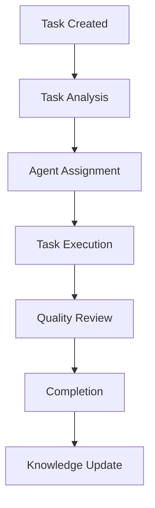

# Agency Swarm Enhancement - User Guide

This guide provides comprehensive instructions for users to effectively utilize the Agency Swarm enhancement features and capabilities.

## 🎯 Overview

The Agency Swarm enhancement introduces dynamic agent communication, intelligent task routing, and real-time collaboration capabilities that transform how agents work together to solve complex problems.

## 📋 Table of Contents

- [Getting Started](#getting-started)
- [Core Concepts](#core-concepts)
- [Agent Communication](#agent-communication)
- [Task Management](#task-management)
- [Knowledge Sharing](#knowledge-sharing)
- [Cost Management](#cost-management)
- [Performance Monitoring](#performance-monitoring)
- [Best Practices](#best-practices)
- [Troubleshooting](#troubleshooting)

## 🚀 Getting Started

### System Requirements

- **Web Browser**: Chrome 90+, Firefox 88+, Safari 14+
- **Internet Connection**: Stable connection for real-time features
- **Authentication**: Valid user credentials with Agency Swarm access

### Initial Setup

1. **Log in to the System**
   ```bash
   Navigate to: https://your-domain.com/login
   Enter your credentials and complete authentication
   ```

2. **Access Agency Swarm Dashboard**
   ```bash
   Go to: /agents in the navigation menu
   You'll see the Agency Swarm dashboard with 6 main tabs
   ```

3. **Configure Your Preferences**
   - Set your default agent preferences
   - Configure budget limits
   - Enable notification preferences

## 🧠 Core Concepts

### Agent Intelligence Tiers

The Agency Swarm system uses three intelligence tiers:

1. **Sonnet Tier** (Default)
   - Balanced performance and cost
   - Ideal for most tasks
   - Smart escalation to higher tiers

2. **Opus Tier** (Premium)
   - Highest capability and reasoning
   - Complex problem solving
   - Strategic planning tasks

3. **Haiku Tier** (Fast)
   - Quick response times
   - Simple tasks and queries
   - High-volume processing

### Agent States

Agents operate in 5 distinct states:

- **IDLE**: Ready to accept tasks
- **ACTIVE**: Currently processing tasks
- **THINKING**: Analyzing and planning
- **HIBERNATING**: Conserving resources (30+ minutes idle)
- **ERROR**: Requires intervention

### Agent Types

Available agent specializations:

- **CODE_IMPLEMENTER**: Software development and coding
- **STRATEGIC_PLANNER**: Project planning and task breakdown
- **KNOWLEDGE_MANAGER**: Information processing and organization
- **QUALITY_ASSURANCE**: Testing and validation
- **SECURITY_ANALYST**: Security assessment and compliance
- **PERFORMANCE_OPTIMIZER**: Performance tuning and optimization

## 💬 Agent Communication

### Real-time Messaging

The Agency Swarm enables real-time communication between agents:

```typescript
// Example of agent communication
const message = {
  from: "code-implementer",
  to: "quality-assurance",
  content: "Code review completed for feature X",
  priority: "normal",
  metadata: {
    taskId: "task-123",
    confidence: 0.95
  }
};
```

### Communication Channels

1. **Direct Messaging**: Point-to-point communication between agents
2. **Broadcast Messages**: One-to-many announcements
3. **Topic-based**: Organized by project or task categories
4. **Emergency Channels**: High-priority issue escalation

### Collaboration Features

- **Shared Context**: Agents can access shared knowledge and context
- **Task Handoffs**: Seamless transfer of tasks between agents
- **Consensus Building**: Multiple agents can collaborate on decisions
- **Expertise Matching**: Automatic routing to most qualified agent

## 📋 Task Management

### Creating Tasks

1. **Manual Task Creation**
   ```bash
   Navigate to Tasks tab
   Click "Create New Task"
   Fill in task details and assign to agents
   ```

2. **Agent-Initiated Tasks**
   ```bash
   Agents can create sub-tasks when needed
   Automatic task breakdown for complex requirements
   Dynamic task assignment based on availability
   ```

### Task Workflow



### Task Monitoring

- **Real-time Progress**: Live updates on task status
- **Performance Metrics**: Execution time, success rate, cost
- **Agent Collaboration**: View agent interactions
- **Escalation Tracking**: Monitor tier escalation events

## 📚 Knowledge Sharing

### Knowledge Base

The Agency Swarm maintains a shared knowledge base:

```typescript
// Knowledge structure
interface KnowledgeItem {
  id: string;
  content: string;
  source: string;
  confidence: number;
  tags: string[];
  createdAt: Date;
  updatedAt: Date;
  accessCount: number;
}
```

### Learning Mechanisms

1. **Experience Sharing**: Agents share successful strategies
2. **Pattern Recognition**: Identify common solutions
3. **Confidence Evolution**: Knowledge accuracy improves over time
4. **Cross-Agent Learning**: Knowledge transfers between agent types

### Knowledge Management Features

- **Search Functionality**: Full-text search with filters
- **Confidence Scoring**: Trust indicators for knowledge items
- **Version Control**: Track knowledge evolution
- **Access Analytics**: Monitor knowledge usage patterns

## 💰 Cost Management

### Budget Tracking

Monitor and control costs effectively:

```typescript
// Cost tracking structure
interface CostTracking {
  agentId: string;
  taskId: string;
  inputTokens: number;
  outputTokens: number;
  modelTier: string;
  totalCost: number;
  timestamp: Date;
  success: boolean;
}
```

### Cost Optimization

1. **Automatic Tier Selection**: Choose most cost-effective tier
2. **Budget Alerts**: Notifications when approaching limits
3. **Usage Analytics**: Identify cost optimization opportunities
4. **ROI Analysis**: Track return on investment for agent usage

### Budget Management

- **Project Budgets**: Set limits per project
- **Agent Pool Limits**: Control concurrent agent usage
- **Alert Thresholds**: Configure warning levels
- **Cost Reports**: Generate detailed cost breakdowns

## 📊 Performance Monitoring

### Real-time Metrics

Monitor system performance in real-time:

- **Agent Performance**: Success rates, response times
- **Task Throughput**: Tasks completed per hour
- **System Health**: Resource utilization, error rates
- **Collaboration Metrics**: Agent interaction patterns

### Analytics Dashboard

Access comprehensive analytics:

1. **Performance Overview**
   - Agent success rates
   - Task completion times
   - Cost efficiency metrics

2. **Collaboration Analysis**
   - Agent interaction frequency
   - Knowledge sharing patterns
   - Task handoff efficiency

3. **Resource Utilization**
   - Agent pool usage
   - Tier distribution
   - Capacity planning

### Alerting System

Receive notifications for:

- **Performance Issues**: Degraded response times
- **Cost Overruns**: Budget threshold breaches
- **System Errors**: Agent failures or errors
- **Security Events**: Unusual access patterns

## 🎯 Best Practices

### For Optimal Performance

1. **Use Appropriate Tiers**
   - Start with Sonnet for most tasks
   - Escalate to Opus for complex problems
   - Use Haiku for simple, high-volume tasks

2. **Effective Task Design**
   - Break down complex tasks into smaller pieces
   - Provide clear requirements and context
   - Set realistic expectations and deadlines

3. **Knowledge Management**
   - Regularly review and update knowledge base
   - Use descriptive tags for better searchability
   - Monitor knowledge confidence scores

4. **Cost Optimization**
   - Monitor usage patterns and adjust budgets
   - Set appropriate alert thresholds
   - Regular review of cost-effectiveness

### For Team Collaboration

1. **Clear Communication**
   - Use specific and descriptive messages
   - Include relevant context in communications
   - Follow established communication protocols

2. **Task Coordination**
   - Coordinate task assignments to avoid conflicts
   - Share progress updates regularly
   - Escalate issues promptly when needed

3. **Knowledge Sharing**
   - Document important learnings and insights
   - Share successful strategies and patterns
   - Maintain knowledge accuracy and relevance

## 🚨 Troubleshooting

### Common Issues

#### 1. Agent Not Responding

**Symptoms**: Agent appears idle but doesn't accept tasks

**Solutions**:
```bash
# Check agent status
kubectl get pods -n agency-swarm

# Restart specific agent
kubectl rollout restart deployment/<agent-name>

# Check logs
kubectl logs <agent-pod> -n agency-swarm
```

#### 2. High Task Failure Rate

**Symptoms**: Multiple agents failing on similar tasks

**Solutions**:
- Review task requirements and clarity
- Check for resource constraints
- Verify agent capabilities match task needs
- Consider escalating to higher intelligence tier

#### 3. Cost Overruns

**Symptoms**: Unexpectedly high costs

**Solutions**:
- Review usage patterns and identify outliers
- Adjust budget limits and alert thresholds
- Optimize agent tier selection
- Implement cost-saving measures

#### 4. Communication Issues

**Symptoms**: Agents not collaborating effectively

**Solutions**:
- Check network connectivity
- Verify message routing configuration
- Review communication protocols
- Monitor for message bottlenecks

### Getting Help

**Support Channels**:
1. **Documentation**: Refer to this guide and API documentation
2. **Community Forum**: Engage with other users
3. **Technical Support**: Contact support team for urgent issues
4. **Status Page**: Check system status and known issues

**When Contacting Support**:
- Provide detailed error information
- Include screenshots where relevant
- Describe steps to reproduce the issue
- Specify urgency and impact

## 📈 Advanced Features

### Automation

1. **Scheduled Tasks**
   ```bash
   Configure recurring tasks
   Set up automated workflows
   Define trigger conditions
   ```

2. **Event-Driven Actions**
   - Automatic responses to system events
   - Conditional task creation
   - Dynamic resource allocation

### Customization

1. **Agent Configuration**
   - Custom agent behaviors
   - Specialized capabilities
   - Performance tuning

2. **Workflow Customization**
   - Custom task flows
   - Specialized approval processes
   - Integration with external systems

### Integration

1. **API Access**
   ```bash
   REST API endpoints
   WebSocket connections
   Webhook support
   ```

2. **Third-party Tools**
   - CI/CD integration
   - Monitoring tools
   - Project management systems

## 🎉 Success Stories

### Case Study 1: Development Team

**Challenge**: Slow code review process
**Solution**: Implemented Agency Swarm with CODE_IMPLEMENTER and QUALITY_ASSURANCE agents
**Result**: 70% reduction in code review time, improved code quality

### Case Study 2: Project Management

**Challenge**: Inefficient task allocation
**Solution**: Used STRATEGIC_PLANNER agents for task breakdown and assignment
**Result**: 50% improvement in project delivery times, better resource utilization

### Case Study 3: Knowledge Management

**Challenge**: Information silos and knowledge loss
**Solution**: Implemented KNOWLEDGE_MANAGER agents with shared knowledge base
**Result**: 90% improvement in information retrieval, reduced onboarding time

## 🔄 Continuous Improvement

The Agency Swarm system continuously evolves:

1. **Performance Monitoring**: Regular analysis of system performance
2. **User Feedback**: Incorporate user suggestions and improvements
3. **Technology Updates**: Stay current with AI capabilities
4. **Security Enhancements**: Regular security updates and improvements

---

For technical implementation details, refer to the [Deployment Guide](DEPLOYMENT_GUIDE.md) or [Administration Guide](ADMINISTRATION_GUIDE.md).