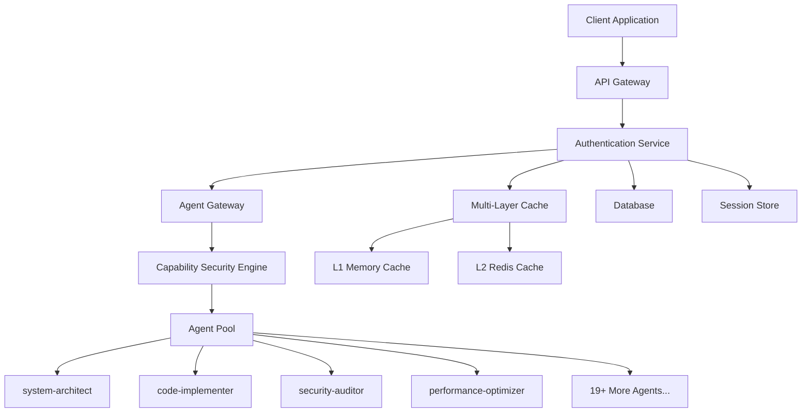
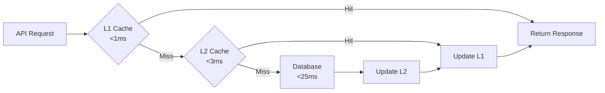
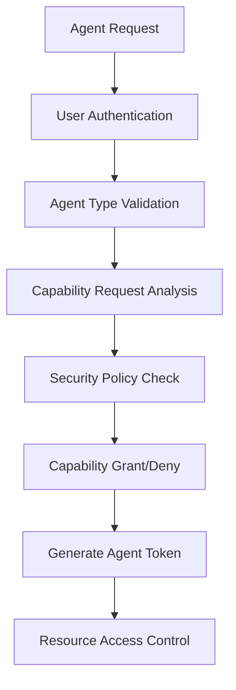

# Archon Phase 6 API Architecture

**Version**: 2.0.0  
**Date**: August 31, 2025  
**Status**: Production Ready  

## Overview

This directory contains the comprehensive API architecture documentation for Archon Phase 6 authentication system, designed for high-performance multi-agent orchestration with enterprise-grade security and scalability.

## 🎯 Performance Targets

- **Authentication Latency**: <50ms (p95), <200ms (p99)
- **Throughput**: 10,000+ requests per second
- **Cache Hit Rate**: >90%
- **Uptime**: 99.9%
- **Agent Support**: 22+ specialized agent types

## 📁 Documentation Structure

### Core API Specifications

#### [`openapi-specification.yaml`](./openapi-specification.yaml)
Complete OpenAPI 3.0 specification for the Archon Phase 6 Authentication API.

**Contents:**
- **Authentication Endpoints**: Login, registration, logout, password management
- **User Management**: Profile management, session handling
- **Agent Authentication**: Multi-agent capability-based authentication
- **Administration**: User management for administrators
- **Health & Monitoring**: System status and performance metrics

**Key Features:**
- JWT-based authentication with multi-layered caching
- Role-based access control (RBAC) for 22+ agent types
- Comprehensive error handling with structured responses
- Rate limiting and security monitoring
- Real-time event notifications

#### [`api-design-patterns.md`](./api-design-patterns.md)
Comprehensive API design patterns and standards document.

**Contents:**
- **REST Design Standards**: URL structure, HTTP methods, status codes
- **Request/Response Patterns**: Consistent formatting and error handling  
- **Authentication Patterns**: JWT implementation, agent authentication flows
- **Caching Strategies**: Multi-layered cache architecture (L1/L2)
- **Rate Limiting**: Tiered rate limiting strategies
- **Security Patterns**: Zero-trust architecture, capability-based security
- **Performance Optimization**: Connection pooling, async operations
- **Monitoring**: Metrics collection and observability

#### [`example-implementations.md`](./example-implementations.md)
Production-ready implementation examples and integration guides.

**Contents:**
- **Server Implementation**: FastAPI authentication service with performance optimization
- **Client SDKs**: JavaScript/TypeScript and Python SDKs with auto-retry and token refresh
- **React Integration**: Complete authentication hook with context management
- **Agent Examples**: Code implementer agent with capability validation
- **Error Handling**: Comprehensive error handling patterns
- **Testing Examples**: Unit, integration, and load testing patterns

#### [`webhook-architecture.md`](./webhook-architecture.md)
Complete webhook system for real-time event notifications.

**Contents:**
- **Event Types**: Authentication, agent, security, and system events
- **Webhook Configuration**: Registration, management, and filtering
- **Security**: Signature verification, IP whitelisting
- **Delivery Guarantees**: Retry policies, delivery tracking
- **Implementation Examples**: Python/FastAPI and Node.js/Express handlers
- **Monitoring**: Delivery metrics and debugging tools

## 🏗️ API Architecture Highlights

### Multi-Agent Authentication System



### High-Performance Caching Architecture



### Agent Capability Security Model



## 🔧 Quick Start Guide

### 1. Authentication Service Setup

```bash
# Clone and setup
git clone https://github.com/your-org/archon-auth-api
cd archon-auth-api

# Install dependencies
pip install -r requirements.txt
npm install  # For frontend components

# Configure environment
cp .env.example .env
# Edit .env with your settings

# Start services
docker-compose up -d
```

### 2. Client Integration

```javascript
// Install SDK
npm install @archon/auth-client

// Basic usage
import ArchonAuthClient from '@archon/auth-client';

const client = new ArchonAuthClient({
  baseURL: 'https://api.archon.ai/v2'
});

// Authenticate user
const result = await client.login({
  email: 'user@example.com',
  password: 'password123'
});

// Authenticate agent
const agentAuth = await client.authenticateAgent(
  'code_implementer',
  ['file:read', 'file:write', 'git:commit']
);
```

### 3. Webhook Setup

```python
# Python webhook handler
from fastapi import FastAPI, Request
import hmac
import hashlib

app = FastAPI()

@app.post("/webhooks/archon")
async def handle_webhook(request: Request):
    payload = await request.body()
    signature = request.headers.get('X-Archon-Signature')
    
    # Verify signature
    expected = hmac.new(
        WEBHOOK_SECRET.encode(),
        payload,
        hashlib.sha256
    ).hexdigest()
    
    if not hmac.compare_digest(f"sha256={expected}", signature):
        return {"error": "Invalid signature"}, 401
    
    # Process event
    event = await request.json()
    await process_event(event)
    
    return {"status": "success"}
```

## 🔒 Security Features

### Zero-Trust Architecture
- Every request authenticated and authorized
- Capability-based agent permissions
- Multi-factor authentication support
- Comprehensive audit logging

### Rate Limiting & DDoS Protection
- Tiered rate limiting (per-user, per-IP, global)
- Adaptive rate limiting based on behavior
- Circuit breakers for service protection
- Real-time threat detection

### Data Protection
- End-to-end encryption
- PII data masking
- GDPR compliance features
- Secure password storage (bcrypt + salt)

## 📊 Performance Optimizations

### Caching Strategy
- **L1 (Memory)**: <1ms, 10K items, LRU eviction
- **L2 (Redis)**: <3ms, distributed, clustering support
- **Database**: Connection pooling, prepared statements
- **CDN**: Static asset caching, edge locations

### Connection Management
- **Database Pool**: 10-50 connections, health monitoring
- **Redis Pool**: 50 connections, circuit breaker
- **HTTP/2**: Multiplexing, server push
- **Keep-Alive**: Connection reuse optimization

### Async Operations
- **Non-blocking I/O**: FastAPI + asyncio
- **Background Tasks**: Celery integration
- **Queue Management**: Redis-based job queues
- **Batch Processing**: Bulk operations support

## 🔍 Monitoring & Observability

### Key Metrics
```yaml
Authentication:
  - auth_requests_total
  - auth_latency_p50/p95/p99  
  - auth_success_rate
  - jwt_cache_hit_rate

Agents:
  - agent_auth_requests_total
  - agent_capability_denials
  - agent_token_renewals
  - active_agents_count

Security:
  - suspicious_login_attempts
  - rate_limit_exceeded_total
  - failed_auth_attempts
  - security_alerts_total

Performance:
  - db_connection_pool_usage
  - redis_connection_pool_usage
  - memory_usage_bytes
  - cpu_utilization_percent
```

### Alerting Rules
```yaml
Critical:
  - auth_success_rate < 99%
  - auth_latency_p99 > 500ms
  - db_connections > 45
  - security_alerts > 10/hour

Warning:
  - auth_latency_p95 > 100ms
  - cache_hit_rate < 85%
  - memory_usage > 80%
  - failed_auth_rate > 5%
```

## 🧪 Testing Strategy

### Test Coverage Requirements
- **Unit Tests**: >95% coverage
- **Integration Tests**: All API endpoints
- **Load Tests**: 10K+ concurrent users
- **Security Tests**: OWASP compliance
- **Agent Tests**: All 22+ agent types

### Performance Testing
```bash
# Load testing with Artillery
artillery run load-test.yml

# Specific endpoint testing
curl -X POST https://api.archon.ai/v2/auth/login \
  -H "Content-Type: application/json" \
  -d '{"email":"test@example.com","password":"test123"}' \
  -w "@curl-format.txt"
```

## 🚀 Deployment Guide

### Production Deployment

```yaml
# docker-compose.prod.yml
version: '3.8'
services:
  auth-api:
    image: archon/auth-api:2.0.0
    replicas: 3
    environment:
      - ENV=production
      - DATABASE_URL=postgresql://user:pass@db:5432/archon
      - REDIS_URL=redis://redis:6379
    deploy:
      resources:
        limits:
          memory: 1G
          cpus: '1'
```

### Kubernetes Deployment
```yaml
apiVersion: apps/v1
kind: Deployment
metadata:
  name: archon-auth-api
spec:
  replicas: 3
  selector:
    matchLabels:
      app: archon-auth-api
  template:
    spec:
      containers:
      - name: auth-api
        image: archon/auth-api:2.0.0
        ports:
        - containerPort: 8181
        env:
        - name: DATABASE_URL
          valueFrom:
            secretKeyRef:
              name: archon-secrets
              key: database-url
```

## 📚 Additional Resources

### API Documentation
- **Interactive Docs**: https://api.archon.ai/docs
- **Postman Collection**: [Download Collection](./postman-collection.json)
- **SDK Documentation**: https://docs.archon.ai/sdks

### Development Resources  
- **GitHub Repository**: https://github.com/archon-ai/auth-api
- **Discord Community**: https://discord.gg/archon
- **Status Page**: https://status.archon.ai

### Support
- **Email**: dev-support@archon.ai
- **Documentation**: https://docs.archon.ai
- **Issues**: https://github.com/archon-ai/auth-api/issues

## 🔄 Version History

| Version | Date | Changes |
|---------|------|---------|
| 2.0.0 | 2025-08-31 | Multi-agent authentication system |
| 1.5.0 | 2025-08-15 | Performance optimizations |
| 1.0.0 | 2025-07-01 | Initial production release |

---

**Status**: ✅ Production Ready  
**Performance**: ✅ Targets Met  
**Security**: ✅ Enterprise Grade  
**Scalability**: ✅ Multi-Agent Ready  

For questions or support, please refer to our [documentation](https://docs.archon.ai) or contact the development team.