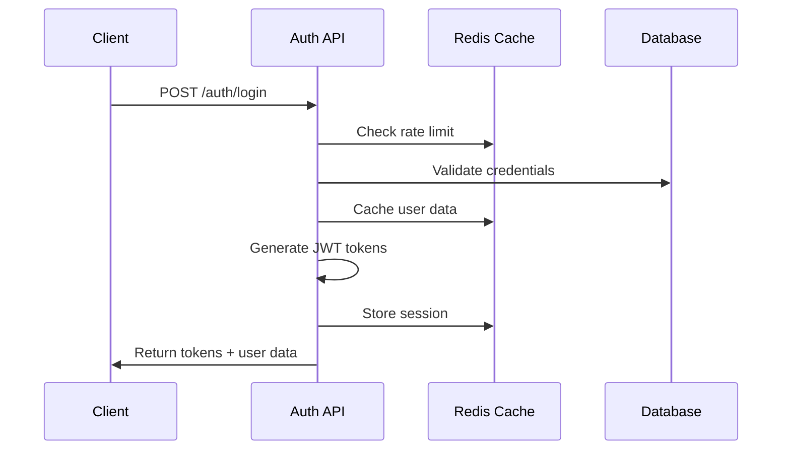
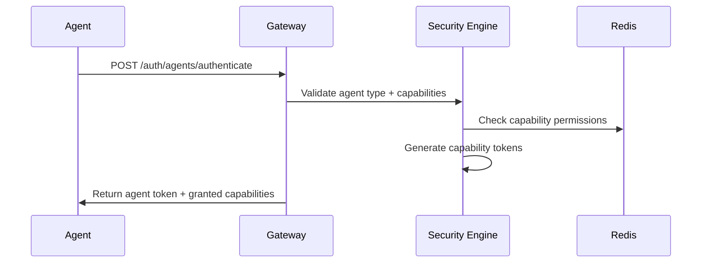

# Archon Phase 6 API Design Patterns & Standards

**Version**: 2.0.0  
**Date**: August 31, 2025  
**Status**: Production Ready  

## Overview

This document defines comprehensive API design patterns and standards for the Archon Phase 6 authentication system, optimized for high-performance multi-agent orchestration with enterprise-grade security.

## Core Design Principles

### 1. Performance-First Architecture
- **Sub-50ms Response Time**: All authentication operations optimized for <50ms p95 latency
- **10,000+ RPS Throughput**: Designed to handle enterprise-scale traffic
- **Multi-Layered Caching**: L1 (memory) + L2 (Redis) caching strategy
- **Connection Pooling**: Optimized database and Redis connection management

### 2. Security-by-Design
- **Zero-Trust Architecture**: Every request validated and authorized
- **Capability-Based Security**: Fine-grained permissions per agent type
- **Defense in Depth**: Multiple security layers with fail-safe defaults
- **Audit Trail**: Comprehensive logging of all authentication events

### 3. Developer Experience Excellence
- **Consistent API Patterns**: Standardized request/response structures
- **Comprehensive Documentation**: OpenAPI 3.0 with examples and SDKs
- **Predictable Error Handling**: Structured error responses with trace IDs
- **Rate Limiting Transparency**: Clear rate limit information in headers

## REST API Design Standards

### URL Structure & Naming Conventions

```
https://api.archon.ai/v{version}/{resource-collection}[/{resource-id}[/{sub-resource}]]
```

**Examples:**
```
GET    /api/v2/users                    # List users
GET    /api/v2/users/me                 # Get current user
PUT    /api/v2/users/me                 # Update current user
GET    /api/v2/users/me/sessions        # Get user sessions
DELETE /api/v2/users/me/sessions/{id}   # Delete specific session
POST   /api/v2/auth/agents/authenticate # Agent authentication
```

**Naming Rules:**
- Use lowercase, hyphenated URLs (`user-profiles`, not `userProfiles`)
- Use plural nouns for collections (`users`, `sessions`)
- Avoid verbs in endpoints (use HTTP methods instead)
- Use nested resources for relationships (`/users/{id}/sessions`)
- Keep URLs under 80 characters for readability

### HTTP Methods & Semantic Usage

| Method | Usage | Idempotent | Safe |
|--------|-------|------------|------|
| `GET` | Retrieve resource(s) | ✅ | ✅ |
| `POST` | Create resource or non-idempotent operations | ❌ | ❌ |
| `PUT` | Replace entire resource | ✅ | ❌ |
| `PATCH` | Partial resource update | ❌ | ❌ |
| `DELETE` | Remove resource | ✅ | ❌ |
| `HEAD` | Check resource existence | ✅ | ✅ |
| `OPTIONS` | Get allowed methods | ✅ | ✅ |

### HTTP Status Code Standards

#### Success Codes (2xx)
```
200 OK                  - Successful GET, PUT, PATCH operations
201 Created             - Successful POST with resource creation
202 Accepted            - Async operation started
204 No Content          - Successful DELETE or PUT with no response body
```

#### Client Error Codes (4xx)
```
400 Bad Request         - Invalid request syntax or parameters
401 Unauthorized        - Authentication required or invalid
403 Forbidden           - Valid auth but insufficient permissions
404 Not Found           - Resource doesn't exist
405 Method Not Allowed  - HTTP method not supported for resource
409 Conflict            - Request conflicts with current state
422 Unprocessable Entity - Valid syntax but semantic errors
429 Too Many Requests   - Rate limit exceeded
```

#### Server Error Codes (5xx)
```
500 Internal Server Error - Generic server error
502 Bad Gateway          - Upstream service error
503 Service Unavailable  - Temporary service outage
504 Gateway Timeout      - Upstream service timeout
```

## Request/Response Structure Standards

### Consistent Response Format

All API responses follow this standardized structure:

```json
{
  "success": true,
  "data": {
    // Response data or null
  },
  "error": {
    // Error details or null
  },
  "meta": {
    "timestamp": "2025-08-31T10:00:00Z",
    "version": "2.0.0",
    "request_id": "req_1234567890",
    "rate_limit": {
      "limit": 1000,
      "remaining": 999,
      "reset": "2025-08-31T11:00:00Z"
    },
    "performance": {
      "response_time_ms": 45.2,
      "cache_hit": true
    }
  }
}
```

### Error Response Structure

```json
{
  "success": false,
  "data": null,
  "error": {
    "code": "VALIDATION_ERROR",
    "message": "Request validation failed",
    "details": {
      "email": "Invalid email format",
      "password": "Password does not meet requirements"
    },
    "trace_id": "trace_abc123",
    "documentation_url": "https://docs.archon.ai/errors/validation-error"
  },
  "meta": {
    "timestamp": "2025-08-31T10:00:00Z",
    "version": "2.0.0",
    "request_id": "req_1234567890"
  }
}
```

### Pagination Standards

For collection endpoints that return multiple items:

```json
{
  "success": true,
  "data": [
    // Array of items
  ],
  "meta": {
    "pagination": {
      "page": 1,
      "limit": 20,
      "total": 150,
      "total_pages": 8,
      "has_next": true,
      "has_prev": false
    }
  }
}
```

**Query Parameters:**
- `page`: Page number (1-based, default: 1)
- `limit`: Items per page (1-100, default: 20)
- `sort_by`: Field to sort by
- `sort_order`: `asc` or `desc` (default: desc)

## Authentication & Authorization Patterns

### JWT Token Structure

```json
{
  "header": {
    "alg": "RS256",
    "typ": "JWT",
    "kid": "key_id_2025"
  },
  "payload": {
    "iss": "archon-auth-service",
    "sub": "user_123e4567-e89b-12d3-a456-426614174000",
    "aud": "archon-api",
    "exp": 1735689600,
    "iat": 1735686000,
    "jti": "token_unique_id",
    "type": "access",
    "roles": ["user", "agent_operator"],
    "permissions": ["read:profile", "create:tasks"],
    "agent_capabilities": ["code_implementer", "system_architect"],
    "session_id": "sess_1234567890"
  }
}
```

### Authentication Flow Patterns

#### Standard User Authentication


#### Agent Authentication with Capabilities


### Authorization Middleware Pattern

```python
# Example middleware implementation
class AuthorizationMiddleware:
    def __init__(self, required_permissions: List[str] = None,
                 required_roles: List[str] = None,
                 allow_agents: bool = False):
        self.required_permissions = required_permissions or []
        self.required_roles = required_roles or []
        self.allow_agents = allow_agents
    
    async def __call__(self, request: Request, call_next):
        # Extract and validate JWT
        token = self.extract_token(request)
        payload = await self.validate_token(token)
        
        # Check permissions
        if not self.check_permissions(payload):
            raise HTTPException(403, "Insufficient permissions")
        
        # Set user context
        request.state.user = payload
        return await call_next(request)
```

## Rate Limiting Strategies

### Tiered Rate Limiting

```yaml
rate_limits:
  authentication:
    login:
      per_ip: 5/minute
      per_user: 10/minute
    register:
      per_ip: 3/minute
      global: 1000/hour
    password_reset:
      per_email: 3/hour
      per_ip: 10/hour

  api_access:
    authenticated:
      per_user: 1000/minute
      burst: 2000
    agent:
      per_agent: 10000/minute
      burst: 20000
    admin:
      per_user: 5000/minute
      burst: 10000

  public:
    health_check:
      per_ip: 60/minute
    documentation:
      per_ip: 100/minute
```

### Rate Limit Headers

Include rate limit information in all responses:

```
X-RateLimit-Limit: 1000
X-RateLimit-Remaining: 999
X-RateLimit-Reset: 1735689600
X-RateLimit-Policy: 1000;w=60
Retry-After: 60  # Only when rate limited
```

## Caching Strategies

### Multi-Layered Cache Architecture

```
┌─────────────┐    ┌─────────────┐    ┌─────────────┐
│  L1 Cache   │    │  L2 Cache   │    │  Database   │
│  (Memory)   │    │  (Redis)    │    │ (Primary)   │
│   <1ms      │    │   <3ms      │    │   <25ms     │
│  10K items  │    │ Distributed │    │ Persistent  │
└─────────────┘    └─────────────┘    └─────────────┘
```

### Cache Key Patterns

```
# User data
user:profile:{user_id}                    # TTL: 300s
user:permissions:{user_id}                # TTL: 600s
user:sessions:{user_id}                   # TTL: 3600s

# JWT validation
jwt:valid:{token_hash}                    # TTL: token_exp - now
jwt:blacklist:{token_jti}                 # TTL: token_exp - now

# Agent capabilities
agent:capabilities:{agent_type}           # TTL: 7200s
agent:token:{token_hash}                  # TTL: token_exp - now

# Rate limiting
rate_limit:{endpoint}:{identifier}        # TTL: window_size
```

### Cache Invalidation Patterns

```python
# User-based invalidation
async def invalidate_user_cache(user_id: str):
    patterns = [
        f"user:profile:{user_id}",
        f"user:permissions:{user_id}",
        f"user:sessions:{user_id}"
    ]
    await redis.delete(*patterns)

# Token-based invalidation
async def invalidate_token_cache(token_jti: str):
    await redis.sadd("jwt:blacklist", token_jti)
    # Cache negative result to avoid database queries
    await redis.setex(f"jwt:blacklist:{token_jti}", 3600, "1")
```

## API Versioning Strategy

### URL Versioning (Primary)
```
/api/v1/users          # Version 1 (Legacy)
/api/v2/users          # Version 2 (Current)
/api/v3/users          # Version 3 (Future)
```

### Header-Based Versioning (Fallback)
```
GET /api/users
Accept-Version: 2.0
API-Version: 2.0
```

### Version Lifecycle Management

```yaml
versions:
  v1:
    status: deprecated
    sunset_date: "2025-12-31"
    support_level: critical_bugs_only
    
  v2:
    status: current
    features: [authentication, user_management, agent_auth]
    support_level: full_support
    
  v3:
    status: preview
    features: [enhanced_agent_auth, federated_identity]
    support_level: beta_testing
```

## Error Handling Patterns

### Error Code Taxonomy

```
# Format: CATEGORY_SPECIFIC_ERROR
AUTH_INVALID_CREDENTIALS      # Authentication errors
AUTH_TOKEN_EXPIRED
AUTH_INSUFFICIENT_PERMISSIONS

USER_NOT_FOUND               # User management errors
USER_ALREADY_EXISTS
USER_EMAIL_NOT_VERIFIED

VALIDATION_REQUIRED_FIELD    # Validation errors
VALIDATION_INVALID_FORMAT
VALIDATION_CONSTRAINT_VIOLATION

RATE_LIMIT_EXCEEDED          # Rate limiting errors
RATE_LIMIT_IP_BLOCKED

SYSTEM_DATABASE_ERROR        # System errors
SYSTEM_SERVICE_UNAVAILABLE
SYSTEM_TIMEOUT
```

### Error Response Examples

#### Validation Error
```json
{
  "success": false,
  "data": null,
  "error": {
    "code": "VALIDATION_REQUIRED_FIELD",
    "message": "Required fields are missing",
    "details": {
      "email": "This field is required",
      "password": "This field is required"
    },
    "trace_id": "trace_abc123"
  }
}
```

#### Authentication Error
```json
{
  "success": false,
  "data": null,
  "error": {
    "code": "AUTH_INVALID_CREDENTIALS",
    "message": "Invalid email or password",
    "details": {
      "attempts_remaining": 2,
      "lockout_duration": "15 minutes"
    },
    "trace_id": "trace_def456"
  }
}
```

#### Rate Limit Error
```json
{
  "success": false,
  "data": null,
  "error": {
    "code": "RATE_LIMIT_EXCEEDED",
    "message": "Rate limit exceeded for this endpoint",
    "details": {
      "limit": 5,
      "window": "1 minute",
      "retry_after": 45
    },
    "trace_id": "trace_ghi789"
  },
  "meta": {
    "rate_limit": {
      "limit": 5,
      "remaining": 0,
      "reset": "2025-08-31T10:01:00Z"
    }
  }
}
```

## Security Patterns

### Request Validation Pipeline

```python
# Security validation order
1. Rate limiting check
2. Request size validation
3. Content-Type validation
4. Authentication token validation
5. Authorization permission check
6. Input sanitization
7. Business logic validation
```

### Security Headers

All responses include security headers:

```
Content-Security-Policy: default-src 'self'
X-Content-Type-Options: nosniff
X-Frame-Options: DENY
X-XSS-Protection: 1; mode=block
Strict-Transport-Security: max-age=31536000; includeSubDomains
Referrer-Policy: strict-origin-when-cross-origin
```

### CORS Configuration

```yaml
cors:
  allow_origins:
    - "https://app.archon.ai"
    - "https://admin.archon.ai"
  allow_methods: [GET, POST, PUT, PATCH, DELETE, OPTIONS]
  allow_headers:
    - Authorization
    - Content-Type
    - X-API-Key
    - X-Request-ID
  expose_headers:
    - X-RateLimit-Limit
    - X-RateLimit-Remaining
    - X-Request-ID
  max_age: 86400
```

## Agent-Specific API Patterns

### Agent Authentication Flow

```json
// Request
{
  "agent_type": "code_implementer",
  "capabilities_requested": [
    "file:read",
    "file:write",
    "git:commit",
    "npm:install"
  ],
  "task_context": {
    "project_id": "proj_123",
    "task_type": "feature_implementation",
    "estimated_duration": 300
  }
}

// Response
{
  "success": true,
  "data": {
    "agent_token": "agent_eyJhbGci...",
    "capabilities_granted": [
      "file:read",
      "file:write",
      "git:commit"
    ],
    "capabilities_denied": [
      "npm:install"  // Requires additional approval
    ],
    "expires_in": 3600,
    "restrictions": {
      "file_paths": ["/project/src/**"],
      "git_branches": ["feature/*"],
      "max_file_size": "10MB"
    }
  }
}
```

### Capability Validation Middleware

```python
class CapabilityValidator:
    async def validate_capability(self, agent_token: str, 
                                capability: str, 
                                resource: str) -> bool:
        # Parse agent token
        payload = await self.validate_agent_token(agent_token)
        
        # Check capability grant
        if capability not in payload.get('capabilities', []):
            return False
        
        # Check resource restrictions
        restrictions = payload.get('restrictions', {})
        if not self.check_resource_access(resource, restrictions):
            return False
        
        # Log capability usage
        await self.log_capability_usage(payload['agent_id'], 
                                      capability, resource)
        
        return True
```

## Performance Optimization Patterns

### Response Time Optimization

```python
# Performance-optimized endpoint pattern
@cache_response(ttl=300, vary=['user_id'])
@rate_limit('1000/minute')
@authenticate()
async def get_user_profile(request: Request) -> JSONResponse:
    user_id = request.state.user['sub']
    
    # Try L1 cache first
    if profile := await memory_cache.get(f"profile:{user_id}"):
        return success_response(profile, cache_hit=True)
    
    # Try L2 cache
    if profile := await redis.get(f"user:profile:{user_id}"):
        await memory_cache.set(f"profile:{user_id}", profile, ttl=60)
        return success_response(profile, cache_hit=True)
    
    # Database query with connection pooling
    async with db_pool.acquire() as conn:
        profile = await conn.fetchrow(
            "SELECT * FROM users WHERE id = $1", user_id
        )
    
    # Cache results
    await redis.setex(f"user:profile:{user_id}", 300, profile)
    await memory_cache.set(f"profile:{user_id}", profile, ttl=60)
    
    return success_response(profile, cache_hit=False)
```

### Connection Pool Optimization

```python
# Database pool configuration
DATABASE_POOL_CONFIG = {
    'min_connections': 10,
    'max_connections': 50,
    'command_timeout': 5.0,
    'server_settings': {
        'jit': 'off',
        'application_name': 'archon-auth-api'
    }
}

# Redis pool configuration  
REDIS_POOL_CONFIG = {
    'max_connections': 50,
    'connection_timeout': 2.0,
    'socket_timeout': 1.0,
    'socket_keepalive': True,
    'retry_on_timeout': True
}
```

## Testing Patterns

### API Testing Structure

```python
# Test categories
tests/
├── unit/
│   ├── test_auth_service.py
│   ├── test_jwt_manager.py
│   └── test_rate_limiter.py
├── integration/
│   ├── test_auth_endpoints.py
│   ├── test_user_management.py
│   └── test_agent_auth.py
├── load/
│   ├── test_auth_performance.py
│   └── test_concurrent_requests.py
└── security/
    ├── test_auth_vulnerabilities.py
    └── test_rate_limit_bypass.py
```

### Performance Testing Targets

```yaml
performance_targets:
  authentication:
    p50_latency: "<50ms"
    p95_latency: "<100ms" 
    p99_latency: "<200ms"
    throughput: ">10,000 RPS"
    
  user_management:
    p50_latency: "<25ms"
    p95_latency: "<50ms"
    throughput: ">5,000 RPS"
    
  agent_authentication:
    p50_latency: "<30ms"
    p95_latency: "<75ms"
    throughput: ">15,000 RPS"
```

## Documentation Standards

### API Documentation Requirements

1. **OpenAPI 3.0 Specification**: Complete with examples and schemas
2. **Interactive Documentation**: Swagger UI with try-it-now functionality  
3. **SDK Documentation**: Client libraries in Python, JavaScript, Go
4. **Integration Guides**: Step-by-step implementation guides
5. **Error Handling Guide**: Complete error code reference
6. **Performance Guide**: Optimization tips and best practices

### Example Documentation Structure

```markdown
# Authentication API Documentation

## Quick Start
- [Installation](#installation)
- [Authentication](#authentication)
- [Rate Limiting](#rate-limiting)
- [Error Handling](#error-handling)

## Endpoints
- [POST /auth/login](#post-authlogin)
- [POST /auth/register](#post-authregister)
- [POST /auth/refresh](#post-authrefresh)

## Examples
- [cURL Examples](#curl-examples)
- [JavaScript SDK](#javascript-sdk)
- [Python SDK](#python-sdk)

## Advanced Topics
- [Agent Authentication](#agent-authentication)
- [Custom Headers](#custom-headers)
- [Webhooks](#webhooks)
```

## Monitoring & Observability Patterns

### Metrics Collection

```python
# Key metrics to track
METRICS = {
    'request_duration': Histogram('http_request_duration_seconds'),
    'request_count': Counter('http_requests_total'),
    'auth_attempts': Counter('auth_attempts_total'),
    'cache_hits': Counter('cache_hits_total'),
    'db_connections': Gauge('db_connections_active'),
    'rate_limit_hits': Counter('rate_limit_exceeded_total')
}

# Middleware for metrics collection
class MetricsMiddleware:
    async def __call__(self, request: Request, call_next):
        start_time = time.time()
        
        response = await call_next(request)
        
        duration = time.time() - start_time
        METRICS['request_duration'].observe(
            duration, 
            method=request.method,
            endpoint=request.url.path,
            status=response.status_code
        )
        
        return response
```

### Health Check Implementation

```python
@router.get("/health")
async def health_check():
    checks = {
        'database': await check_database(),
        'redis': await check_redis(),
        'jwt_service': await check_jwt_service(),
        'rate_limiter': await check_rate_limiter()
    }
    
    overall_status = 'healthy' if all(
        check['status'] == 'healthy' for check in checks.values()
    ) else 'unhealthy'
    
    return {
        'status': overall_status,
        'timestamp': datetime.utcnow().isoformat(),
        'version': '2.0.0',
        'uptime': get_uptime_seconds(),
        'checks': checks,
        'performance': {
            'avg_response_time': get_avg_response_time(),
            'requests_per_second': get_current_rps(),
            'cache_hit_rate': get_cache_hit_rate()
        }
    }
```

This comprehensive API design patterns document provides the foundation for building high-performance, secure, and maintainable authentication APIs for the Archon Phase 6 system. All patterns are optimized for the multi-agent architecture while maintaining enterprise-grade security and performance standards.