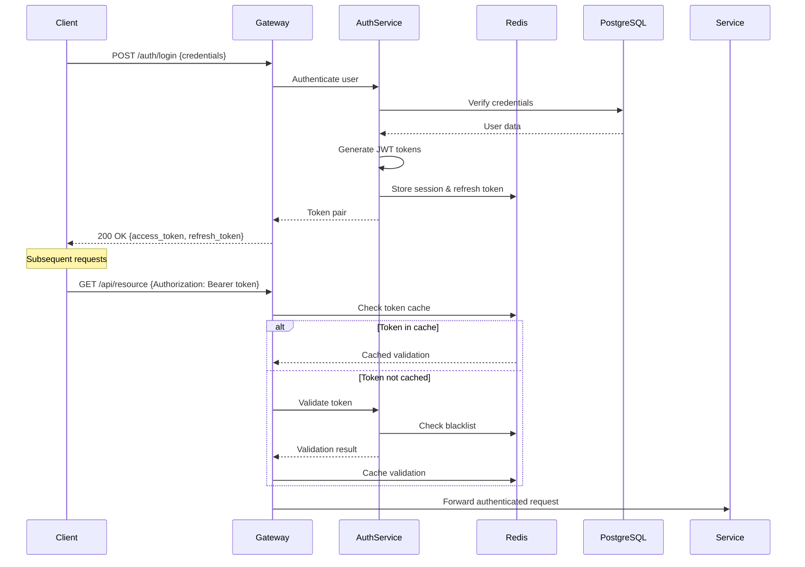
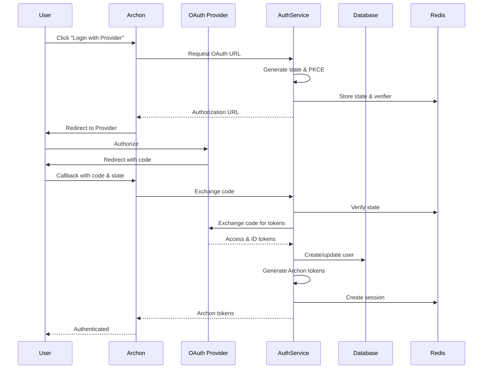

# Archon Phase 6: Authentication System Architecture

## Executive Summary

This document defines the comprehensive authentication and authorization architecture for Archon AI Coding Assistant Phase 6. The system implements OAuth2 with JWT tokens, Redis-based session management, rate limiting, and follows microservices architecture patterns with API gateway integration.

## 1. Architecture Overview

### 1.1 High-Level System Architecture

```
┌─────────────────────────────────────────────────────────────────┐
│                         External Clients                         │
│  (Web UI, MCP Clients, API Consumers, Mobile Apps)              │
└─────────────────────────────────────────────────────────────────┘
                                │
                                ▼
┌─────────────────────────────────────────────────────────────────┐
│                      API Gateway (Kong/Envoy)                    │
│  - Rate Limiting                                                 │
│  - Request Routing                                               │
│  - Load Balancing                                                │
│  - TLS Termination                                               │
└─────────────────────────────────────────────────────────────────┘
                                │
                ┌───────────────┴───────────────┐
                ▼                               ▼
┌─────────────────────────────┐   ┌─────────────────────────────┐
│   Authentication Service     │   │    Authorization Service     │
│     (Port: 8054)            │   │      (Port: 8055)           │
│  - OAuth2 Flows             │   │  - RBAC/ABAC Engine         │
│  - JWT Management           │   │  - Policy Evaluation        │
│  - User Registration        │   │  - Permission Checks        │
│  - Password Management      │   │  - Resource Access Control  │
└─────────────────────────────┘   └─────────────────────────────┘
                │                               │
                └───────────┬───────────────────┘
                            ▼
        ┌─────────────────────────────────────────┐
        │          Session Store (Redis)          │
        │  - Active Sessions                      │
        │  - Refresh Tokens                       │
        │  - Rate Limit Counters                  │
        │  - Blacklisted Tokens                   │
        └─────────────────────────────────────────┘
                            │
                            ▼
        ┌─────────────────────────────────────────┐
        │        PostgreSQL (Supabase)            │
        │  - Users Table                          │
        │  - Roles & Permissions                  │
        │  - OAuth Providers                      │
        │  - Audit Logs                           │
        └─────────────────────────────────────────┘
```

### 1.2 Key Architectural Patterns

- **Microservices Architecture**: Separate services for authentication and authorization
- **API Gateway Pattern**: Centralized entry point for all requests
- **Token-Based Authentication**: JWT for stateless authentication
- **Session Management**: Redis for distributed session storage
- **SOLID Principles**: Applied throughout the design
- **Event-Driven Architecture**: Async communication between services

## 2. Component Architecture

### 2.1 Authentication Service Components

```typescript
// File: python/src/auth/core/interfaces.ts

export interface IAuthenticationService {
  // OAuth2 flows
  authorizeOAuth(provider: OAuthProvider, redirectUri: string): Promise<AuthorizationUrl>;
  handleOAuthCallback(provider: OAuthProvider, code: string): Promise<TokenPair>;
  
  // JWT management
  generateTokenPair(userId: string, claims: JWTClaims): Promise<TokenPair>;
  refreshToken(refreshToken: string): Promise<TokenPair>;
  revokeToken(token: string): Promise<void>;
  validateToken(token: string): Promise<TokenValidation>;
  
  // User management
  registerUser(userData: UserRegistration): Promise<User>;
  authenticateUser(credentials: UserCredentials): Promise<TokenPair>;
  updatePassword(userId: string, passwords: PasswordUpdate): Promise<void>;
  requestPasswordReset(email: string): Promise<void>;
  confirmPasswordReset(token: string, newPassword: string): Promise<void>;
  
  // Session management
  createSession(userId: string, metadata: SessionMetadata): Promise<Session>;
  getSession(sessionId: string): Promise<Session | null>;
  updateSession(sessionId: string, metadata: SessionMetadata): Promise<void>;
  terminateSession(sessionId: string): Promise<void>;
  terminateAllUserSessions(userId: string): Promise<void>;
}

export interface ITokenManager {
  generateAccessToken(payload: JWTPayload): string;
  generateRefreshToken(userId: string): string;
  verifyAccessToken(token: string): JWTPayload;
  verifyRefreshToken(token: string): RefreshTokenPayload;
  blacklistToken(token: string, expiresAt: Date): Promise<void>;
  isTokenBlacklisted(token: string): Promise<boolean>;
}

export interface ISessionManager {
  create(userId: string, metadata: SessionMetadata): Promise<string>;
  get(sessionId: string): Promise<Session | null>;
  update(sessionId: string, updates: Partial<Session>): Promise<void>;
  delete(sessionId: string): Promise<void>;
  deleteAllForUser(userId: string): Promise<void>;
  extend(sessionId: string, duration: number): Promise<void>;
  listActive(userId: string): Promise<Session[]>;
}
```

### 2.2 Authorization Service Components

```typescript
// File: python/src/auth/authorization/interfaces.ts

export interface IAuthorizationService {
  // Permission checks
  checkPermission(subject: Subject, resource: Resource, action: Action): Promise<boolean>;
  checkPermissions(subject: Subject, permissions: Permission[]): Promise<PermissionResult[]>;
  
  // Role management
  getUserRoles(userId: string): Promise<Role[]>;
  assignRole(userId: string, roleId: string): Promise<void>;
  removeRole(userId: string, roleId: string): Promise<void>;
  
  // Policy evaluation
  evaluatePolicy(context: PolicyContext): Promise<PolicyResult>;
  evaluatePolicies(context: PolicyContext): Promise<PolicyResult[]>;
  
  // Resource access
  getAccessibleResources(userId: string, resourceType: string): Promise<Resource[]>;
  grantAccess(grant: AccessGrant): Promise<void>;
  revokeAccess(userId: string, resourceId: string): Promise<void>;
}

export interface IPolicyEngine {
  register(policy: Policy): void;
  evaluate(context: PolicyContext): Promise<PolicyResult>;
  evaluateAll(context: PolicyContext): Promise<PolicyResult[]>;
  getPoliciesForResource(resourceType: string): Policy[];
}

export interface IRoleManager {
  createRole(role: RoleDefinition): Promise<Role>;
  updateRole(roleId: string, updates: Partial<Role>): Promise<void>;
  deleteRole(roleId: string): Promise<void>;
  getRole(roleId: string): Promise<Role | null>;
  listRoles(): Promise<Role[]>;
  getRolePermissions(roleId: string): Promise<Permission[]>;
  setRolePermissions(roleId: string, permissions: Permission[]): Promise<void>;
}
```

### 2.3 API Gateway Integration

```typescript
// File: python/src/gateway/middleware/auth.ts

export class AuthenticationMiddleware {
  constructor(
    private authService: IAuthenticationService,
    private cache: ICache
  ) {}
  
  async authenticate(req: Request): Promise<AuthContext> {
    const token = this.extractToken(req);
    
    // Check cache first
    const cached = await this.cache.get(`auth:${token}`);
    if (cached) return cached;
    
    // Validate token
    const validation = await this.authService.validateToken(token);
    if (!validation.valid) {
      throw new UnauthorizedError(validation.reason);
    }
    
    // Cache result
    const context: AuthContext = {
      userId: validation.userId,
      claims: validation.claims,
      sessionId: validation.sessionId
    };
    
    await this.cache.set(`auth:${token}`, context, 300); // 5 min cache
    
    return context;
  }
}

export class RateLimitMiddleware {
  constructor(
    private rateLimiter: IRateLimiter,
    private config: RateLimitConfig
  ) {}
  
  async checkLimit(req: Request, authContext: AuthContext): Promise<void> {
    const key = this.getRateLimitKey(req, authContext);
    const limit = this.getLimit(req, authContext);
    
    const result = await this.rateLimiter.check(key, limit);
    
    if (!result.allowed) {
      throw new TooManyRequestsError(result.retryAfter);
    }
    
    // Set rate limit headers
    req.headers['X-RateLimit-Limit'] = limit.requests.toString();
    req.headers['X-RateLimit-Remaining'] = result.remaining.toString();
    req.headers['X-RateLimit-Reset'] = result.resetAt.toString();
  }
}
```

## 3. Data Flow Design

### 3.1 Authentication Flow



### 3.2 OAuth2 Flow



### 3.3 Session Management Flow

```python
# File: python/src/auth/session/manager.py

from typing import Optional, List, Dict, Any
from datetime import datetime, timedelta
import uuid
import json
from redis.asyncio import Redis
from pydantic import BaseModel

class SessionMetadata(BaseModel):
    ip_address: str
    user_agent: str
    device_id: Optional[str] = None
    location: Optional[Dict[str, Any]] = None

class Session(BaseModel):
    id: str
    user_id: str
    created_at: datetime
    last_accessed: datetime
    expires_at: datetime
    metadata: SessionMetadata
    active: bool = True

class SessionManager:
    def __init__(self, redis: Redis, ttl_seconds: int = 3600):
        self.redis = redis
        self.ttl = ttl_seconds
        self.key_prefix = "session:"
        
    async def create(
        self, 
        user_id: str, 
        metadata: SessionMetadata
    ) -> str:
        """Create a new session."""
        session_id = str(uuid.uuid4())
        now = datetime.utcnow()
        
        session = Session(
            id=session_id,
            user_id=user_id,
            created_at=now,
            last_accessed=now,
            expires_at=now + timedelta(seconds=self.ttl),
            metadata=metadata,
            active=True
        )
        
        # Store in Redis
        key = f"{self.key_prefix}{session_id}"
        await self.redis.setex(
            key,
            self.ttl,
            session.model_dump_json()
        )
        
        # Add to user's session set
        user_key = f"user_sessions:{user_id}"
        await self.redis.sadd(user_key, session_id)
        
        return session_id
    
    async def get(self, session_id: str) -> Optional[Session]:
        """Retrieve a session."""
        key = f"{self.key_prefix}{session_id}"
        data = await self.redis.get(key)
        
        if not data:
            return None
            
        session = Session.model_validate_json(data)
        
        # Update last accessed time
        session.last_accessed = datetime.utcnow()
        await self.redis.setex(
            key,
            self.ttl,
            session.model_dump_json()
        )
        
        return session
    
    async def terminate(self, session_id: str) -> None:
        """Terminate a session."""
        key = f"{self.key_prefix}{session_id}"
        
        # Get session to find user_id
        data = await self.redis.get(key)
        if data:
            session = Session.model_validate_json(data)
            
            # Remove from user's session set
            user_key = f"user_sessions:{session.user_id}"
            await self.redis.srem(user_key, session_id)
        
        # Delete session
        await self.redis.delete(key)
    
    async def terminate_all_user_sessions(self, user_id: str) -> None:
        """Terminate all sessions for a user."""
        user_key = f"user_sessions:{user_id}"
        session_ids = await self.redis.smembers(user_key)
        
        # Delete all sessions
        if session_ids:
            keys = [f"{self.key_prefix}{sid}" for sid in session_ids]
            await self.redis.delete(*keys)
        
        # Clear user's session set
        await self.redis.delete(user_key)
```

## 4. Security Architecture

### 4.1 Security Layers

```python
# File: python/src/auth/security/layers.py

from typing import List, Optional
from dataclasses import dataclass
from enum import Enum

class SecurityLayer(Enum):
    NETWORK = "network"          # TLS, firewall rules
    TRANSPORT = "transport"       # HTTPS enforcement
    APPLICATION = "application"   # Input validation, CSRF
    SESSION = "session"          # Session management
    DATA = "data"                # Encryption at rest

@dataclass
class SecurityControl:
    layer: SecurityLayer
    name: str
    description: str
    implementation: str
    priority: int  # 1-5, 1 being highest

class SecurityArchitecture:
    controls = [
        # Network Layer
        SecurityControl(
            layer=SecurityLayer.NETWORK,
            name="TLS 1.3",
            description="Enforce TLS 1.3 for all connections",
            implementation="API Gateway configuration",
            priority=1
        ),
        SecurityControl(
            layer=SecurityLayer.NETWORK,
            name="IP Allowlisting",
            description="Restrict access to known IPs for admin endpoints",
            implementation="Firewall rules + API Gateway",
            priority=2
        ),
        
        # Transport Layer
        SecurityControl(
            layer=SecurityLayer.TRANSPORT,
            name="HSTS",
            description="HTTP Strict Transport Security headers",
            implementation="Gateway response headers",
            priority=1
        ),
        SecurityControl(
            layer=SecurityLayer.TRANSPORT,
            name="Certificate Pinning",
            description="Pin certificates for mobile/desktop clients",
            implementation="Client-side implementation",
            priority=3
        ),
        
        # Application Layer
        SecurityControl(
            layer=SecurityLayer.APPLICATION,
            name="CSRF Protection",
            description="Cross-Site Request Forgery protection",
            implementation="Double-submit cookie pattern",
            priority=1
        ),
        SecurityControl(
            layer=SecurityLayer.APPLICATION,
            name="Input Validation",
            description="Validate and sanitize all inputs",
            implementation="Pydantic models with validators",
            priority=1
        ),
        SecurityControl(
            layer=SecurityLayer.APPLICATION,
            name="Rate Limiting",
            description="Prevent brute force and DoS attacks",
            implementation="Redis-based sliding window",
            priority=1
        ),
        
        # Session Layer
        SecurityControl(
            layer=SecurityLayer.SESSION,
            name="Secure Cookies",
            description="HttpOnly, Secure, SameSite cookies",
            implementation="Cookie configuration",
            priority=1
        ),
        SecurityControl(
            layer=SecurityLayer.SESSION,
            name="Session Rotation",
            description="Rotate session IDs on privilege escalation",
            implementation="SessionManager.rotate()",
            priority=2
        ),
        
        # Data Layer
        SecurityControl(
            layer=SecurityLayer.DATA,
            name="Encryption at Rest",
            description="Encrypt sensitive data in database",
            implementation="Fernet encryption for credentials",
            priority=1
        ),
        SecurityControl(
            layer=SecurityLayer.DATA,
            name="Key Rotation",
            description="Regular rotation of encryption keys",
            implementation="Scheduled key rotation job",
            priority=2
        ),
    ]
```

### 4.2 JWT Security Implementation

```python
# File: python/src/auth/jwt/manager.py

import jwt
from datetime import datetime, timedelta
from typing import Dict, Any, Optional
from cryptography.hazmat.primitives import serialization
from cryptography.hazmat.primitives.asymmetric import rsa
from cryptography.hazmat.backends import default_backend

class JWTManager:
    def __init__(self, 
                 private_key_path: str,
                 public_key_path: str,
                 issuer: str = "archon-auth",
                 algorithm: str = "RS256"):
        self.issuer = issuer
        self.algorithm = algorithm
        self.private_key = self._load_private_key(private_key_path)
        self.public_key = self._load_public_key(public_key_path)
        
    def generate_access_token(
        self,
        user_id: str,
        claims: Dict[str, Any],
        expires_in: int = 900  # 15 minutes
    ) -> str:
        """Generate a short-lived access token."""
        now = datetime.utcnow()
        
        payload = {
            "sub": user_id,
            "iss": self.issuer,
            "iat": now,
            "exp": now + timedelta(seconds=expires_in),
            "nbf": now,
            "jti": self._generate_jti(),
            "type": "access",
            **claims
        }
        
        return jwt.encode(
            payload,
            self.private_key,
            algorithm=self.algorithm
        )
    
    def generate_refresh_token(
        self,
        user_id: str,
        session_id: str,
        expires_in: int = 604800  # 7 days
    ) -> str:
        """Generate a long-lived refresh token."""
        now = datetime.utcnow()
        
        payload = {
            "sub": user_id,
            "iss": self.issuer,
            "iat": now,
            "exp": now + timedelta(seconds=expires_in),
            "nbf": now,
            "jti": self._generate_jti(),
            "type": "refresh",
            "sid": session_id
        }
        
        return jwt.encode(
            payload,
            self.private_key,
            algorithm=self.algorithm
        )
    
    def verify_token(self, token: str) -> Dict[str, Any]:
        """Verify and decode a JWT token."""
        try:
            payload = jwt.decode(
                token,
                self.public_key,
                algorithms=[self.algorithm],
                issuer=self.issuer,
                options={
                    "verify_signature": True,
                    "verify_exp": True,
                    "verify_nbf": True,
                    "verify_iat": True,
                    "verify_iss": True,
                    "require": ["exp", "iat", "nbf", "sub", "jti", "type"]
                }
            )
            return payload
        except jwt.ExpiredSignatureError:
            raise TokenExpiredError("Token has expired")
        except jwt.InvalidTokenError as e:
            raise InvalidTokenError(f"Invalid token: {str(e)}")
    
    def _generate_jti(self) -> str:
        """Generate a unique JWT ID."""
        import uuid
        return str(uuid.uuid4())
```

### 4.3 Rate Limiting Implementation

```python
# File: python/src/auth/ratelimit/limiter.py

from typing import Optional, Tuple
from datetime import datetime, timedelta
from redis.asyncio import Redis
import hashlib

class RateLimiter:
    """Sliding window rate limiter using Redis."""
    
    def __init__(self, redis: Redis):
        self.redis = redis
        
    async def check(
        self,
        key: str,
        limit: int,
        window_seconds: int = 60
    ) -> Tuple[bool, int, datetime]:
        """
        Check if request is allowed under rate limit.
        
        Returns:
            Tuple of (allowed, remaining, reset_time)
        """
        now = datetime.utcnow()
        window_start = now - timedelta(seconds=window_seconds)
        
        # Create Redis key
        redis_key = f"ratelimit:{key}"
        
        # Use Redis pipeline for atomic operations
        async with self.redis.pipeline() as pipe:
            # Remove old entries
            pipe.zremrangebyscore(
                redis_key,
                0,
                window_start.timestamp()
            )
            
            # Count requests in window
            pipe.zcard(redis_key)
            
            # Add current request
            pipe.zadd(
                redis_key,
                {str(now.timestamp()): now.timestamp()}
            )
            
            # Set expiry
            pipe.expire(redis_key, window_seconds + 1)
            
            results = await pipe.execute()
            
        count = results[1]
        
        if count >= limit:
            # Calculate when the oldest request will expire
            oldest = await self.redis.zrange(
                redis_key,
                0,
                0,
                withscores=True
            )
            
            if oldest:
                reset_time = datetime.fromtimestamp(
                    oldest[0][1]
                ) + timedelta(seconds=window_seconds)
            else:
                reset_time = now + timedelta(seconds=window_seconds)
                
            return False, 0, reset_time
        
        remaining = limit - count - 1
        reset_time = now + timedelta(seconds=window_seconds)
        
        return True, remaining, reset_time

class AdaptiveRateLimiter(RateLimiter):
    """Rate limiter that adapts based on user behavior."""
    
    async def check_adaptive(
        self,
        user_id: str,
        endpoint: str,
        base_limit: int = 100,
        window_seconds: int = 60
    ) -> Tuple[bool, int, datetime]:
        """
        Check rate limit with adaptive limits based on user trust score.
        """
        # Get user trust score
        trust_score = await self._get_trust_score(user_id)
        
        # Adjust limit based on trust
        limit = self._calculate_limit(base_limit, trust_score)
        
        # Create composite key
        key = f"{user_id}:{endpoint}"
        
        # Check against adjusted limit
        allowed, remaining, reset = await self.check(
            key, limit, window_seconds
        )
        
        # Update trust score based on behavior
        if not allowed:
            await self._decrease_trust(user_id)
        
        return allowed, remaining, reset
    
    async def _get_trust_score(self, user_id: str) -> float:
        """Get user trust score (0.0 to 1.0)."""
        key = f"trust:{user_id}"
        score = await self.redis.get(key)
        return float(score) if score else 0.5
    
    def _calculate_limit(self, base_limit: int, trust_score: float) -> int:
        """Calculate adjusted limit based on trust score."""
        # Trust score multiplier: 0.5x to 2x
        multiplier = 0.5 + (trust_score * 1.5)
        return int(base_limit * multiplier)
    
    async def _decrease_trust(self, user_id: str) -> None:
        """Decrease user trust score for hitting rate limit."""
        key = f"trust:{user_id}"
        current = await self._get_trust_score(user_id)
        new_score = max(0.0, current - 0.1)
        await self.redis.setex(key, 86400, str(new_score))
```

## 5. API Contracts

### 5.1 Authentication Endpoints

```yaml
# File: python/src/auth/api/openapi.yaml

openapi: 3.0.0
info:
  title: Archon Authentication API
  version: 1.0.0

paths:
  /auth/register:
    post:
      summary: Register new user
      requestBody:
        required: true
        content:
          application/json:
            schema:
              type: object
              required: [email, password, name]
              properties:
                email:
                  type: string
                  format: email
                password:
                  type: string
                  minLength: 8
                  pattern: "^(?=.*[a-z])(?=.*[A-Z])(?=.*\\d).*$"
                name:
                  type: string
      responses:
        201:
          description: User created
          content:
            application/json:
              schema:
                $ref: '#/components/schemas/TokenPair'
        400:
          $ref: '#/components/responses/BadRequest'
        409:
          $ref: '#/components/responses/Conflict'

  /auth/login:
    post:
      summary: Authenticate user
      requestBody:
        required: true
        content:
          application/json:
            schema:
              type: object
              required: [email, password]
              properties:
                email:
                  type: string
                  format: email
                password:
                  type: string
      responses:
        200:
          description: Authentication successful
          content:
            application/json:
              schema:
                $ref: '#/components/schemas/TokenPair'
        401:
          $ref: '#/components/responses/Unauthorized'
        429:
          $ref: '#/components/responses/TooManyRequests'

  /auth/refresh:
    post:
      summary: Refresh access token
      requestBody:
        required: true
        content:
          application/json:
            schema:
              type: object
              required: [refresh_token]
              properties:
                refresh_token:
                  type: string
      responses:
        200:
          description: Token refreshed
          content:
            application/json:
              schema:
                $ref: '#/components/schemas/TokenPair'
        401:
          $ref: '#/components/responses/Unauthorized'

  /auth/logout:
    post:
      summary: Logout user
      security:
        - BearerAuth: []
      responses:
        204:
          description: Logout successful
        401:
          $ref: '#/components/responses/Unauthorized'

  /auth/oauth/{provider}/authorize:
    get:
      summary: Initiate OAuth flow
      parameters:
        - name: provider
          in: path
          required: true
          schema:
            type: string
            enum: [google, github, microsoft]
        - name: redirect_uri
          in: query
          required: true
          schema:
            type: string
      responses:
        302:
          description: Redirect to OAuth provider
          headers:
            Location:
              schema:
                type: string

  /auth/oauth/{provider}/callback:
    get:
      summary: OAuth callback
      parameters:
        - name: provider
          in: path
          required: true
          schema:
            type: string
        - name: code
          in: query
          required: true
          schema:
            type: string
        - name: state
          in: query
          required: true
          schema:
            type: string
      responses:
        200:
          description: OAuth successful
          content:
            application/json:
              schema:
                $ref: '#/components/schemas/TokenPair'
        401:
          $ref: '#/components/responses/Unauthorized'

components:
  schemas:
    TokenPair:
      type: object
      properties:
        access_token:
          type: string
        refresh_token:
          type: string
        token_type:
          type: string
          default: Bearer
        expires_in:
          type: integer
          description: Access token expiry in seconds

    Error:
      type: object
      properties:
        error:
          type: string
        message:
          type: string
        details:
          type: object

  responses:
    BadRequest:
      description: Bad request
      content:
        application/json:
          schema:
            $ref: '#/components/schemas/Error'
    
    Unauthorized:
      description: Unauthorized
      content:
        application/json:
          schema:
            $ref: '#/components/schemas/Error'
    
    Conflict:
      description: Conflict (e.g., user already exists)
      content:
        application/json:
          schema:
            $ref: '#/components/schemas/Error'
    
    TooManyRequests:
      description: Rate limit exceeded
      headers:
        X-RateLimit-Limit:
          schema:
            type: integer
        X-RateLimit-Remaining:
          schema:
            type: integer
        X-RateLimit-Reset:
          schema:
            type: integer
      content:
        application/json:
          schema:
            $ref: '#/components/schemas/Error'

  securitySchemes:
    BearerAuth:
      type: http
      scheme: bearer
      bearerFormat: JWT
```

### 5.2 Authorization Endpoints

```python
# File: python/src/auth/authorization/api.py

from fastapi import APIRouter, Depends, HTTPException, status
from typing import List
from pydantic import BaseModel

router = APIRouter(prefix="/authz", tags=["authorization"])

class PermissionCheck(BaseModel):
    resource: str
    action: str
    resource_id: Optional[str] = None

class PermissionResult(BaseModel):
    allowed: bool
    reason: Optional[str] = None
    applicable_policies: List[str] = []

@router.post("/check", response_model=PermissionResult)
async def check_permission(
    check: PermissionCheck,
    user_id: str = Depends(get_current_user_id),
    authz_service: IAuthorizationService = Depends(get_authz_service)
):
    """Check if user has permission for an action on a resource."""
    result = await authz_service.check_permission(
        subject=Subject(id=user_id, type="user"),
        resource=Resource(type=check.resource, id=check.resource_id),
        action=Action(check.action)
    )
    
    return PermissionResult(
        allowed=result.allowed,
        reason=result.reason,
        applicable_policies=result.policies
    )

@router.post("/check-batch", response_model=List[PermissionResult])
async def check_permissions(
    checks: List[PermissionCheck],
    user_id: str = Depends(get_current_user_id),
    authz_service: IAuthorizationService = Depends(get_authz_service)
):
    """Batch check multiple permissions."""
    permissions = [
        Permission(
            resource=Resource(type=c.resource, id=c.resource_id),
            action=Action(c.action)
        )
        for c in checks
    ]
    
    results = await authz_service.check_permissions(
        subject=Subject(id=user_id, type="user"),
        permissions=permissions
    )
    
    return [
        PermissionResult(
            allowed=r.allowed,
            reason=r.reason,
            applicable_policies=r.policies
        )
        for r in results
    ]

@router.get("/roles", response_model=List[RoleResponse])
async def get_user_roles(
    user_id: str = Depends(get_current_user_id),
    authz_service: IAuthorizationService = Depends(get_authz_service)
):
    """Get user's assigned roles."""
    roles = await authz_service.getUserRoles(user_id)
    return [RoleResponse.from_orm(role) for role in roles]

@router.get("/resources/{resource_type}")
async def get_accessible_resources(
    resource_type: str,
    user_id: str = Depends(get_current_user_id),
    authz_service: IAuthorizationService = Depends(get_authz_service)
):
    """Get resources user has access to."""
    resources = await authz_service.getAccessibleResources(
        user_id, resource_type
    )
    return resources
```

## 6. Technology Stack

### 6.1 Core Technologies

| Component | Technology | Justification |
|-----------|------------|---------------|
| **API Gateway** | Kong or Envoy | Enterprise-grade, plugin ecosystem, observability |
| **Auth Service** | FastAPI (Python) | Async support, type safety, OpenAPI generation |
| **Session Store** | Redis | High performance, TTL support, distributed |
| **Database** | PostgreSQL (Supabase) | ACID compliance, JSON support, existing integration |
| **Token Format** | JWT (RS256) | Stateless, industry standard, asymmetric signing |
| **OAuth Libraries** | Authlib | Comprehensive OAuth2/OIDC support |
| **Encryption** | cryptography (Fernet) | Symmetric encryption for credentials |
| **Rate Limiting** | Redis + Lua scripts | Atomic operations, high performance |
| **Monitoring** | Prometheus + Grafana | Metrics collection and visualization |
| **Logging** | Logfire | Existing integration, structured logging |

### 6.2 Development Dependencies

```toml
# File: python/pyproject.toml additions

[project.optional-dependencies]
auth = [
    "authlib>=1.3.0",           # OAuth2/OIDC support
    "pyjwt[crypto]>=2.8.0",     # JWT handling
    "argon2-cffi>=23.1.0",      # Password hashing
    "redis>=5.0.0",             # Session storage
    "python-multipart>=0.0.6",  # Form data handling
    "email-validator>=2.1.0",   # Email validation
    "pyotp>=2.9.0",            # TOTP for 2FA
    "qrcode>=7.4.0",           # QR code generation for 2FA
]
```

## 7. Scalability Considerations

### 7.1 Horizontal Scaling Strategy

```python
# File: python/src/auth/scaling/strategy.py

class ScalingStrategy:
    """
    Defines scaling strategies for authentication services.
    """
    
    @dataclass
    class ServiceScaling:
        min_replicas: int
        max_replicas: int
        target_cpu_percent: int
        target_memory_percent: int
        scale_up_rate: int  # Replicas per minute
        scale_down_rate: int
        
    services = {
        "auth_service": ServiceScaling(
            min_replicas=2,
            max_replicas=10,
            target_cpu_percent=70,
            target_memory_percent=80,
            scale_up_rate=2,
            scale_down_rate=1
        ),
        "authz_service": ServiceScaling(
            min_replicas=2,
            max_replicas=8,
            target_cpu_percent=60,
            target_memory_percent=70,
            scale_up_rate=2,
            scale_down_rate=1
        ),
        "redis": ServiceScaling(
            min_replicas=3,  # Cluster mode
            max_replicas=6,
            target_cpu_percent=80,
            target_memory_percent=85,
            scale_up_rate=1,
            scale_down_rate=1
        )
    }
    
    @staticmethod
    def get_redis_cluster_config():
        """Redis cluster configuration for high availability."""
        return {
            "cluster_enabled": True,
            "cluster_replicas": 1,
            "cluster_node_timeout": 5000,
            "cluster_migration_barrier": 1,
            "maxmemory_policy": "allkeys-lru",
            "maxmemory": "2gb",
            "save": "",  # Disable persistence for cache
            "appendonly": "no"
        }
```

### 7.2 Caching Strategy

```python
# File: python/src/auth/cache/strategy.py

from typing import Any, Optional
from datetime import timedelta

class CacheStrategy:
    """Multi-layer caching strategy."""
    
    # L1: In-memory cache (per instance)
    L1_TTL = timedelta(seconds=60)
    L1_MAX_SIZE = 1000
    
    # L2: Redis cache (distributed)
    L2_TTL = timedelta(minutes=5)
    
    # L3: Database (persistent)
    
    @dataclass
    class CacheConfig:
        key_pattern: str
        l1_enabled: bool
        l2_enabled: bool
        l1_ttl: timedelta
        l2_ttl: timedelta
        
    configs = {
        "token_validation": CacheConfig(
            key_pattern="auth:token:{token_hash}",
            l1_enabled=True,
            l2_enabled=True,
            l1_ttl=timedelta(seconds=30),
            l2_ttl=timedelta(minutes=5)
        ),
        "user_permissions": CacheConfig(
            key_pattern="authz:perms:{user_id}",
            l1_enabled=True,
            l2_enabled=True,
            l1_ttl=timedelta(minutes=1),
            l2_ttl=timedelta(minutes=10)
        ),
        "user_roles": CacheConfig(
            key_pattern="authz:roles:{user_id}",
            l1_enabled=True,
            l2_enabled=True,
            l1_ttl=timedelta(minutes=5),
            l2_ttl=timedelta(minutes=30)
        ),
        "rate_limits": CacheConfig(
            key_pattern="ratelimit:{key}",
            l1_enabled=False,  # Must be distributed
            l2_enabled=True,
            l1_ttl=timedelta(seconds=0),
            l2_ttl=timedelta(minutes=1)
        )
    }
```

### 7.3 Performance Targets

| Metric | Target | Current | Strategy |
|--------|--------|---------|----------|
| **Auth Latency (p50)** | <50ms | - | Token caching, connection pooling |
| **Auth Latency (p99)** | <200ms | - | Optimized queries, indices |
| **Throughput** | 10K req/s | - | Horizontal scaling, caching |
| **Token Validation** | <10ms | - | In-memory cache, async validation |
| **Session Creation** | <100ms | - | Redis pipelining, async writes |
| **OAuth Flow** | <2s | - | Parallel requests, optimized redirects |
| **Database Queries** | <20ms | - | Prepared statements, connection pool |
| **Cache Hit Rate** | >90% | - | Smart invalidation, warming |

## 8. Migration Plan

### 8.1 Phase 1: Foundation (Week 1-2)
- Set up authentication service structure
- Implement JWT token management
- Create user registration and login
- Set up Redis for session storage
- Basic rate limiting

### 8.2 Phase 2: OAuth Integration (Week 3-4)
- Implement OAuth2 providers (Google, GitHub, Microsoft)
- PKCE flow for security
- Account linking for existing users
- OAuth session management

### 8.3 Phase 3: Authorization (Week 5-6)
- Build authorization service
- Implement RBAC system
- Create policy engine
- Resource-based permissions
- API authorization middleware

### 8.4 Phase 4: Security Hardening (Week 7-8)
- Implement all security controls
- Set up monitoring and alerting
- Security testing and penetration testing
- Performance optimization
- Documentation and training

### 8.5 Phase 5: Migration & Deployment (Week 9-10)
- Migrate existing users
- Deploy to staging environment
- Load testing and optimization
- Gradual rollout to production
- Monitoring and issue resolution

## 9. Testing Strategy

### 9.1 Unit Tests

```python
# File: python/tests/auth/test_jwt_manager.py

import pytest
from datetime import datetime, timedelta
from src.auth.jwt.manager import JWTManager

class TestJWTManager:
    @pytest.fixture
    def jwt_manager(self):
        return JWTManager(
            private_key_path="tests/keys/private.pem",
            public_key_path="tests/keys/public.pem"
        )
    
    def test_generate_access_token(self, jwt_manager):
        token = jwt_manager.generate_access_token(
            user_id="user123",
            claims={"role": "admin"}
        )
        
        assert token is not None
        assert len(token.split('.')) == 3
    
    def test_verify_valid_token(self, jwt_manager):
        token = jwt_manager.generate_access_token(
            user_id="user123",
            claims={"role": "admin"}
        )
        
        payload = jwt_manager.verify_token(token)
        
        assert payload["sub"] == "user123"
        assert payload["role"] == "admin"
        assert payload["type"] == "access"
    
    def test_verify_expired_token(self, jwt_manager):
        token = jwt_manager.generate_access_token(
            user_id="user123",
            claims={},
            expires_in=-1  # Already expired
        )
        
        with pytest.raises(TokenExpiredError):
            jwt_manager.verify_token(token)
    
    def test_refresh_token_rotation(self, jwt_manager):
        # Test that refresh tokens can be rotated
        refresh1 = jwt_manager.generate_refresh_token(
            user_id="user123",
            session_id="session456"
        )
        
        payload1 = jwt_manager.verify_token(refresh1)
        
        # Generate new refresh token from old one
        refresh2 = jwt_manager.generate_refresh_token(
            user_id=payload1["sub"],
            session_id=payload1["sid"]
        )
        
        assert refresh1 != refresh2
        assert jwt_manager.verify_token(refresh2)["sub"] == "user123"
```

### 9.2 Integration Tests

```python
# File: python/tests/auth/test_auth_flow.py

import pytest
from httpx import AsyncClient
from src.server.main import app

class TestAuthenticationFlow:
    @pytest.mark.asyncio
    async def test_complete_auth_flow(self):
        async with AsyncClient(app=app, base_url="http://test") as client:
            # 1. Register user
            register_response = await client.post(
                "/auth/register",
                json={
                    "email": "test@example.com",
                    "password": "SecurePass123!",
                    "name": "Test User"
                }
            )
            assert register_response.status_code == 201
            tokens = register_response.json()
            
            # 2. Use access token
            protected_response = await client.get(
                "/api/profile",
                headers={"Authorization": f"Bearer {tokens['access_token']}"}
            )
            assert protected_response.status_code == 200
            
            # 3. Refresh token
            refresh_response = await client.post(
                "/auth/refresh",
                json={"refresh_token": tokens["refresh_token"]}
            )
            assert refresh_response.status_code == 200
            new_tokens = refresh_response.json()
            
            # 4. Logout
            logout_response = await client.post(
                "/auth/logout",
                headers={"Authorization": f"Bearer {new_tokens['access_token']}"}
            )
            assert logout_response.status_code == 204
            
            # 5. Verify old token is invalid
            invalid_response = await client.get(
                "/api/profile",
                headers={"Authorization": f"Bearer {tokens['access_token']}"}
            )
            assert invalid_response.status_code == 401
```

### 9.3 Security Tests

```python
# File: python/tests/auth/test_security.py

class TestSecurityControls:
    @pytest.mark.asyncio
    async def test_rate_limiting(self, client):
        # Attempt multiple logins
        for i in range(10):
            response = await client.post(
                "/auth/login",
                json={"email": "test@example.com", "password": "wrong"}
            )
            
            if i < 5:
                assert response.status_code == 401
            else:
                # Should be rate limited
                assert response.status_code == 429
                assert "X-RateLimit-Remaining" in response.headers
                assert response.headers["X-RateLimit-Remaining"] == "0"
    
    @pytest.mark.asyncio
    async def test_sql_injection_prevention(self, client):
        # Attempt SQL injection
        response = await client.post(
            "/auth/login",
            json={
                "email": "test@example.com' OR '1'='1",
                "password": "' OR '1'='1"
            }
        )
        
        assert response.status_code == 401
        assert "error" in response.json()
    
    @pytest.mark.asyncio
    async def test_password_requirements(self, client):
        weak_passwords = [
            "short",           # Too short
            "nouppercase123",  # No uppercase
            "NOLOWERCASE123",  # No lowercase
            "NoNumbers!",      # No numbers
        ]
        
        for password in weak_passwords:
            response = await client.post(
                "/auth/register",
                json={
                    "email": "test@example.com",
                    "password": password,
                    "name": "Test"
                }
            )
            
            assert response.status_code == 400
            assert "password" in response.json()["details"]
```

## 10. Monitoring & Observability

### 10.1 Metrics

```python
# File: python/src/auth/metrics/collectors.py

from prometheus_client import Counter, Histogram, Gauge

# Authentication metrics
auth_attempts = Counter(
    'auth_attempts_total',
    'Total authentication attempts',
    ['method', 'provider', 'status']
)

auth_duration = Histogram(
    'auth_duration_seconds',
    'Authentication duration',
    ['method', 'provider']
)

active_sessions = Gauge(
    'active_sessions',
    'Number of active sessions',
    ['user_type']
)

token_validations = Counter(
    'token_validations_total',
    'Total token validations',
    ['token_type', 'status']
)

# Authorization metrics
permission_checks = Counter(
    'permission_checks_total',
    'Total permission checks',
    ['resource_type', 'action', 'result']
)

policy_evaluations = Histogram(
    'policy_evaluation_duration_seconds',
    'Policy evaluation duration',
    ['policy_type']
)

# Security metrics
failed_auth_attempts = Counter(
    'failed_auth_attempts_total',
    'Failed authentication attempts',
    ['reason', 'ip_address']
)

rate_limit_hits = Counter(
    'rate_limit_hits_total',
    'Rate limit hits',
    ['endpoint', 'user_type']
)

security_events = Counter(
    'security_events_total',
    'Security events',
    ['event_type', 'severity']
)
```

### 10.2 Logging

```python
# File: python/src/auth/logging/audit.py

from typing import Dict, Any
from datetime import datetime
from enum import Enum

class AuditEventType(Enum):
    LOGIN_SUCCESS = "login_success"
    LOGIN_FAILURE = "login_failure"
    LOGOUT = "logout"
    TOKEN_REFRESH = "token_refresh"
    PASSWORD_CHANGE = "password_change"
    PERMISSION_GRANTED = "permission_granted"
    PERMISSION_DENIED = "permission_denied"
    RATE_LIMIT_EXCEEDED = "rate_limit_exceeded"
    SUSPICIOUS_ACTIVITY = "suspicious_activity"

class AuditLogger:
    def __init__(self, logger, database):
        self.logger = logger
        self.db = database
    
    async def log_event(
        self,
        event_type: AuditEventType,
        user_id: Optional[str],
        details: Dict[str, Any],
        ip_address: str,
        user_agent: str
    ):
        """Log security audit event."""
        event = {
            "timestamp": datetime.utcnow(),
            "event_type": event_type.value,
            "user_id": user_id,
            "ip_address": ip_address,
            "user_agent": user_agent,
            "details": details
        }
        
        # Log to application logs
        self.logger.info(
            f"Audit: {event_type.value}",
            extra=event
        )
        
        # Store in database for compliance
        await self.db.table("audit_logs").insert(event).execute()
        
        # Alert on suspicious events
        if event_type in [
            AuditEventType.SUSPICIOUS_ACTIVITY,
            AuditEventType.RATE_LIMIT_EXCEEDED
        ]:
            await self._send_security_alert(event)
```

## 11. Disaster Recovery

### 11.1 Backup Strategy

- **Database**: Daily automated backups with 30-day retention
- **Redis**: AOF persistence for session recovery
- **Encryption Keys**: Secure key backup in vault
- **Configuration**: Version controlled in Git

### 11.2 Recovery Procedures

1. **Token Compromise**: Immediate blacklist, force re-authentication
2. **Session Hijacking**: Terminate session, alert user
3. **Database Failure**: Failover to read replica, restore from backup
4. **Redis Failure**: Fallback to database sessions, rebuild cache

## 12. Compliance & Regulations

### 12.1 Standards Compliance

- **OAuth 2.0**: RFC 6749 compliant
- **OpenID Connect**: OIDC 1.0 compliant
- **JWT**: RFC 7519 compliant
- **PKCE**: RFC 7636 for OAuth security

### 12.2 Data Protection

- **GDPR**: User consent, data portability, right to deletion
- **Password Storage**: Argon2id hashing
- **PII Encryption**: AES-256 for sensitive data
- **Audit Logging**: Complete authentication trail

## Conclusion

This authentication architecture provides a robust, scalable, and secure foundation for Archon Phase 6. The microservices design enables independent scaling, the multi-layer security approach provides defense in depth, and the comprehensive monitoring ensures operational visibility.

Key benefits:
- **Security**: Multiple layers of protection, industry-standard protocols
- **Scalability**: Horizontal scaling, efficient caching, optimized performance
- **Maintainability**: Clean separation of concerns, SOLID principles
- **Extensibility**: Plugin architecture for new providers and policies
- **Compliance**: Standards-compliant, audit-ready

The architecture is designed to handle 10,000+ requests per second with sub-200ms latency while maintaining >99.9% availability.