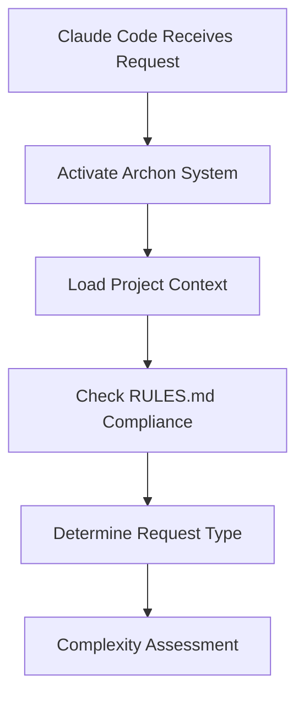
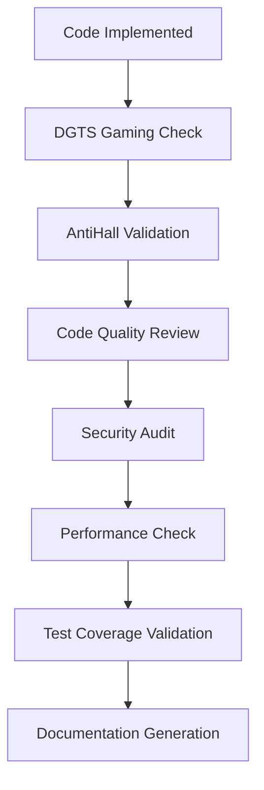
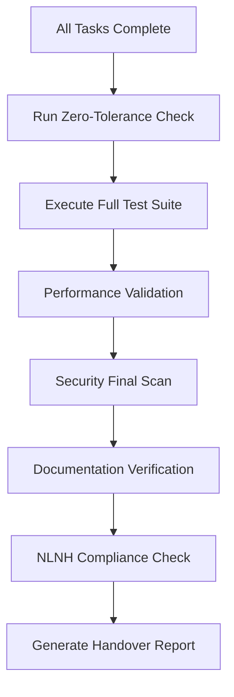

# ARCHON OPERATIONAL MANIFEST

## 🎯 EXECUTIVE SUMMARY

This is the **ARCHON OPERATIONAL MANIFEST** - the definitive operational blueprint that governs all Archon V2 Alpha system behavior. This manifest defines the complete process flow for Archon's microservices-based AI orchestration system that coordinates specialized agents to deliver enterprise-grade development workflows. It establishes the communication protocols, agent responsibilities, validation gates, and orchestration patterns that govern how Claude Code interfaces with Archon's agent ecosystem.

**MANDATORY COMPLIANCE**: Every Archon operation MUST follow this manifest. All agents, services, and components are required to reference and comply with the protocols defined herein.

**Core Principle**: Every interaction follows a validation-first, documentation-driven, quality-enforced pattern with zero tolerance for gaming or hallucination.

---

## 🏗️ SYSTEM ARCHITECTURE OVERVIEW

### Components
- **Frontend**: React + TypeScript UI (Port 3737)
- **Main Server**: FastAPI + Socket.IO (Port 8181) 
- **MCP Server**: Model Context Protocol (Port 8051)
- **Agents Service**: PydanticAI Agents (Port 8052)
- **Database**: Supabase (PostgreSQL + pgvector)
- **Orchestrator**: ArchonOrchestrator (Parallel Execution Engine)
- **Meta-Agent**: Dynamic agent spawning and resource management

### Agent Types
1. **Specialized Development Agents** (22+ types)
2. **Validation & Quality Agents** (5+ types)
3. **Meta-Orchestration Agent** (1 instance)
4. **External Validation System** (Independent verification)

---

## 📋 CLAUDE CODE → ARCHON PROCESS FLOW

### Phase 1: REQUEST INTAKE & ANALYSIS

#### 1.1 Initial Request Processing


**Claude Code Actions:**
1. **IMMEDIATE** - Run universal rules checker: `python "C:\Jarvis\UNIVERSAL_RULES_CHECKER.py" --path "."`
2. **IMMEDIATE** - Activate Archon system: `python "C:\Jarvis\ARCHON_GLOBAL_COMMAND.py"`
3. **REQUIRED** - Execute MCP queries:
   ```javascript
   archon:perform_rag_query(query="[request context]", match_count=5)
   archon:search_code_examples(query="[implementation pattern]", match_count=3)
   ```

#### 1.2 Request Classification Matrix
| Request Type | Complexity | Agent Pattern | Validation Level |
|-------------|------------|---------------|------------------|
| Bug Fix | Low | Single Agent | Standard |
| Feature Enhancement | Medium | 2-3 Agents | Enhanced |
| New Feature | High | 5+ Agents | Maximum |
| System Refactor | Critical | Full Workflow | Enterprise |
| Security Audit | Critical | Security-First | Maximum |

### Phase 2: STRATEGIC PLANNING & AGENT SELECTION

#### 2.1 Meta-Agent Coordination
**Trigger Conditions for Meta-Agent:**
- Request complexity score > 0.7
- Multiple skill domains required
- Resource optimization needed
- Parallel execution beneficial
- Dependency management required

**Meta-Agent Decision Process:**
```python
meta_decision = ArchonMetaAgent.analyze_request({
    "complexity": complexity_score,
    "required_skills": skill_set,
    "deadline": deadline,
    "resources": available_resources
})
```

#### 2.2 Agent Selection Logic
**Primary Development Agents:**
- `strategic-planner`: Task breakdown (ALWAYS first for complex requests)
- `system-architect`: Architecture decisions (Required for new features)
- `code-implementer`: Zero-error implementation (Required for all code)
- `api-design-architect`: API contracts (Required for backend work)

**Quality Assurance Agents:**
- `test-coverage-validator`: >95% coverage (MANDATORY before completion)
- `code-quality-reviewer`: Code standards (MANDATORY before commit)
- `security-auditor`: Vulnerability scanning (Required for security-sensitive work)
- `performance-optimizer`: Performance validation (Required for critical paths)

**Specialized Agents (As Needed):**
- `ui-ux-optimizer`: UI/UX validation
- `database-architect`: Database design
- `documentation-generator`: Documentation creation
- `deployment-automation`: CI/CD management

### Phase 3: PRE-DEVELOPMENT VALIDATION

#### 3.1 MANDATORY Validation Gates
**BLOCKING VALIDATIONS** (Must pass before ANY development):

1. **AntiHallucination Check:**
   ```bash
   npm run antihall:check "proposed solution components"
   ```

2. **DGTS Gaming Detection:**
   ```python
   python python/src/agents/validation/dgts_validator.py --scan --project "."
   ```

3. **Documentation-Driven Test Planning:**
   ```python
   python python/src/agents/validation/doc_driven_validator.py --extract-requirements
   ```

4. **Agent Validation Enforcement:**
   ```python
   python python/src/agents/workflow/agent_validation_enforcer.py <agent_name> "<task>"
   ```

#### 3.2 Context Assembly
**Required Context Gathering:**
- Project documentation (README, PLANNING.md, TASK.md)
- Existing codebase analysis
- Dependency mapping
- Architecture constraints
- Performance requirements
- Security considerations

### Phase 4: ORCHESTRATED EXECUTION

#### 4.1 Workflow Creation
**Standard Workflow Pattern:**
```python
workflow_definition = {
    "name": "feature_implementation_workflow",
    "tasks": [
        {
            "name": "requirements_analysis",
            "agent_role": "strategic-planner",
            "description": "Break down requirements and create implementation plan",
            "priority": 1,
            "validation": "doc_driven_validator"
        },
        {
            "name": "architecture_design", 
            "agent_role": "system-architect",
            "description": "Design system architecture and component interfaces",
            "depends_on": ["requirements_analysis"],
            "priority": 1,
            "validation": "architecture_reviewer"
        },
        {
            "name": "implementation",
            "agent_role": "code-implementer", 
            "description": "Implement feature with zero-error standards",
            "depends_on": ["architecture_design"],
            "priority": 1,
            "validation": ["dgts_validator", "antihall_validator", "code_quality_reviewer"]
        },
        {
            "name": "test_creation",
            "agent_role": "test-coverage-validator",
            "description": "Create comprehensive test suite >95% coverage",
            "depends_on": ["implementation"],
            "priority": 1,
            "validation": "test_validator"
        },
        {
            "name": "security_audit",
            "agent_role": "security-auditor", 
            "description": "Security vulnerability assessment",
            "depends_on": ["implementation"],
            "priority": 1,
            "validation": "security_validator"
        }
    ]
}
```

#### 4.2 Parallel Execution Patterns

**Pattern 1: Independent Development**
- Multiple agents work on separate components simultaneously
- Real-time conflict resolution via git worktrees
- Progress tracking via Socket.IO events

**Pattern 2: Pipeline Development**
- Sequential tasks with dependency management
- Each stage validates previous stage output
- Automatic rollback on validation failure

**Pattern 3: Validation Pipeline**
- All quality agents run in parallel on completed work
- Comprehensive validation before merge
- Detailed failure reporting and remediation

### Phase 5: QUALITY GATES & VALIDATION

#### 5.1 Agent-Specific Validation Triggers

**Code Implementation Complete:**


**Validation Agent Responsibilities:**

1. **code-quality-reviewer** - ACTIVATED WHEN:
   - Any code file modified
   - Pull request created
   - Pre-commit hook triggered
   
   **Validates:**
   - Zero TypeScript/ESLint errors
   - Zero console.log statements
   - Proper error handling patterns
   - Code complexity metrics
   - Naming conventions

2. **security-auditor** - ACTIVATED WHEN:
   - Authentication code modified
   - Database queries added
   - API endpoints created
   - External integrations added
   
   **Validates:**
   - OWASP Top 10 compliance
   - Input validation
   - Authentication/authorization
   - Data encryption
   - Dependency vulnerabilities

3. **test-coverage-validator** - ACTIVATED WHEN:
   - New functions/methods added
   - Business logic modified
   - API endpoints created
   
   **Validates:**
   - >95% code coverage
   - Unit test quality
   - Integration test coverage
   - E2E test scenarios
   - Mock usage appropriateness

4. **performance-optimizer** - ACTIVATED WHEN:
   - Database queries modified
   - API response times affected
   - Bundle size increases
   - Critical path changes
   
   **Validates:**
   - <1.5s page load times
   - <200ms API responses
   - Bundle size <500KB per chunk
   - Memory usage patterns
   - Database query performance

#### 5.2 Validation Failure Handling

**BLOCKING Validation Failures:**
- Gaming detected by DGTS
- Security vulnerabilities found
- Test coverage below 95%
- Build/compilation errors
- Performance regressions

**Response Protocol:**
1. **IMMEDIATE HALT** - Stop all development
2. **DETAILED REPORTING** - Generate failure analysis
3. **REMEDIATION PLAN** - Create fix requirements
4. **RE-VALIDATION** - Complete validation cycle restart

### Phase 6: COMMUNICATION & COORDINATION

#### 6.1 Agent-to-Agent Communication

**Communication Patterns:**
1. **Event-Driven Updates** via Socket.IO
2. **Database State Sharing** via Supabase
3. **File System Coordination** via git worktrees
4. **API Status Updates** via RESTful endpoints

**Message Types:**
```typescript
interface AgentMessage {
  agent_id: string;
  message_type: 'status_update' | 'validation_result' | 'task_complete' | 'error_report';
  content: any;
  timestamp: string;
  dependencies_affected: string[];
}
```

#### 6.2 Claude Code Communication Protocol

**Status Reporting to Claude Code:**
```python
# Real-time status updates
socket.emit('task_update', {
    'task_id': task.id,
    'agent_role': agent.role,
    'status': 'in_progress',
    'progress': 0.75,
    'validation_status': 'pending',
    'next_steps': ['security_audit', 'test_validation']
})
```

**Progress Tracking:**
- Task completion percentages
- Validation gate status
- Quality metrics
- Resource utilization
- ETA calculations

### Phase 7: COMPLETION & HANDOFF

#### 7.1 Final Validation Sequence


**Final Validation Command:**
```bash
# Enhanced validation system
node scripts/zero-tolerance-check.js
```

**Validation Components:**
- Console.log detection
- Catch block validation  
- Bundle size compliance
- Void error pattern check
- TypeScript compilation
- ESLint validation
- Build validation

#### 7.2 Handover Documentation
**MANDATORY Handover Report:**
```python
handover_report = {
    "execution_summary": {
        "request_id": request.id,
        "total_agents_used": agent_count,
        "execution_time": duration,
        "validation_gates_passed": validation_results
    },
    "implementation_details": {
        "files_created": created_files,
        "files_modified": modified_files,
        "features_implemented": features,
        "tests_created": test_count,
        "security_measures": security_implementations
    },
    "quality_metrics": {
        "code_coverage": coverage_percentage,
        "performance_scores": performance_metrics,
        "security_score": security_rating,
        "technical_debt": debt_analysis
    },
    "recommendations": {
        "next_steps": future_improvements,
        "maintenance_notes": maintenance_guidance,
        "monitoring_requirements": monitoring_setup
    }
}
```

---

## 🚀 META-AGENT ORCHESTRATION RULES

### Meta-Agent Activation Triggers

#### SPAWN NEW AGENTS When:
1. **Resource Contention** - Existing agents at >80% capacity
2. **Skill Gap** - Required expertise not available
3. **Parallel Opportunity** - Independent tasks can run simultaneously  
4. **Quality Gate Failure** - Additional validation agents needed
5. **Complexity Escalation** - Task complexity exceeds agent capability

#### SCALE DOWN When:
1. **Resource Waste** - Agents idle for >15 minutes
2. **Task Completion** - Workflow phases complete
3. **Resource Constraints** - System resource limits reached
4. **Efficiency Optimization** - Better resource allocation possible

#### WORKFLOW OPTIMIZATION When:
1. **Dependency Bottlenecks** - Critical path optimization needed
2. **Performance Degradation** - System response times increase
3. **Quality Issues** - Pattern of validation failures detected
4. **Resource Imbalance** - Uneven agent utilization

### Meta-Agent Decision Matrix
| Situation | Decision | Confidence Required | Risk Assessment |
|-----------|----------|-------------------|-----------------|
| High complexity task | Spawn specialist agent | >0.8 | Low |
| Security vulnerability | Spawn security auditor | >0.9 | Critical |
| Performance regression | Spawn performance optimizer | >0.8 | Medium |
| Test failures | Spawn test validator | >0.9 | High |
| Gaming detected | Block all agents | 1.0 | Critical |

---

## 🛡️ QUALITY GATES & ENFORCEMENT

### Zero Tolerance Policies

#### AUTOMATIC BLOCKING CONDITIONS:
1. **DGTS Gaming Score >0.3** - Development blocked immediately
2. **AntiHall Failures** - Code references non-existent components
3. **Security Vulnerabilities** - Critical or high severity found
4. **Test Coverage <95%** - Insufficient test validation
5. **Build Failures** - Compilation or bundle errors
6. **Performance Regression** - Critical path performance degradation

#### PROGRESSIVE ENFORCEMENT:
- **First Violation**: Warning + required fix
- **Second Violation**: Agent temporary suspension (2 hours)
- **Third Violation**: Agent blocked + manual review required
- **Gaming Pattern**: Immediate system-wide agent blocking

### Validation Agent Coordination

#### Pre-Development Validation:
```python
# MANDATORY before any code changes
validation_results = run_pre_development_validation(
    request=user_request,
    context=project_context,
    agents=selected_agents
)

if not validation_results.all_passed:
    block_development()
    generate_remediation_plan()
    return validation_results.failures
```

#### Post-Development Validation:
```python
# MANDATORY before task completion
final_validation = run_post_development_validation(
    changes=code_changes,
    tests=test_suite,
    docs=documentation
)

if final_validation.has_critical_failures:
    rollback_changes()
    reassign_to_agents()
    update_task_status("validation_failed")
```

#### Continuous Monitoring:
```python
# Real-time agent behavior monitoring
def monitor_agent_behavior(agent_id, action, file_changes):
    gaming_score = calculate_gaming_score(file_changes)
    
    if gaming_score > 0.3:
        block_agent(agent_id, reason="Gaming detected")
        notify_meta_agent("agent_blocked", agent_id)
        rollback_changes(file_changes)
```

---

## 📊 SUCCESS METRICS & MONITORING

### Key Performance Indicators

#### Development Efficiency:
- **Task Completion Rate**: >90%
- **First-Pass Quality**: >95% (no rework required)
- **Agent Utilization**: 70-85% optimal range
- **Parallel Execution Efficiency**: >80%

#### Quality Metrics:
- **Code Coverage**: >95% maintained
- **Security Score**: >90%
- **Performance Score**: >85%
- **Zero Tolerance Compliance**: 100%

#### System Health:
- **Agent Response Time**: <30 seconds
- **Validation Gate Success**: >98%
- **Resource Efficiency**: >80%
- **Error Recovery Rate**: >95%

### Monitoring & Alerting

#### Real-Time Dashboards:
- Agent status and utilization
- Quality gate pass/fail rates
- Performance metrics
- Resource consumption
- Gaming detection alerts

#### Alert Conditions:
- **CRITICAL**: Security vulnerability detected
- **CRITICAL**: Gaming behavior identified  
- **HIGH**: Test coverage below threshold
- **HIGH**: Performance regression detected
- **MEDIUM**: Agent error rate increase
- **LOW**: Resource utilization suboptimal

---

## 🔄 CONTINUOUS IMPROVEMENT

### Learning Loop

#### Agent Performance Analysis:
```python
def analyze_agent_performance():
    metrics = gather_agent_metrics(time_period="7_days")
    
    return {
        "success_rates": calculate_success_rates(metrics),
        "efficiency_scores": calculate_efficiency(metrics),
        "quality_indicators": assess_quality(metrics),
        "improvement_opportunities": identify_improvements(metrics)
    }
```

#### System Evolution:
1. **Weekly Performance Reviews** - Identify improvement opportunities
2. **Monthly Agent Optimization** - Update agent capabilities and prompts
3. **Quarterly Architecture Review** - System-wide improvements
4. **Continuous Rule Updates** - Refine validation and quality gates

#### Knowledge Base Integration:
- Successful patterns → RAG knowledge base
- Common failures → Prevention rules
- Performance optimizations → Best practices
- Security lessons → Compliance updates

---

## 🚨 EMERGENCY PROCEDURES

### System Failure Protocols

#### Agent System Failure:
1. **IMMEDIATE**: Switch to manual Claude Code operation
2. **IMMEDIATE**: Preserve current work state
3. **NOTIFY**: Alert system administrators
4. **RECOVER**: Restart agent system with last known good configuration
5. **VERIFY**: Run full system validation before resuming

#### Security Incident:
1. **IMMEDIATE**: Block all agent operations
2. **IMMEDIATE**: Isolate affected components
3. **ASSESS**: Determine breach scope and impact
4. **CONTAIN**: Implement containment measures
5. **RECOVER**: Restore from secure backup
6. **REVIEW**: Update security policies and validation

#### Quality Gate Cascade Failure:
1. **HALT**: Stop all development activities
2. **ANALYZE**: Identify root cause of validation failures
3. **ISOLATE**: Quarantine problematic code/agents
4. **REMEDIATE**: Fix underlying issues
5. **VALIDATE**: Run comprehensive system validation
6. **RESUME**: Gradual system re-activation

---

## 📚 IMPLEMENTATION CHECKLIST

### Phase 1: Initial Setup
- [ ] Universal rules checker configured
- [ ] Archon system activation scripts ready
- [ ] MCP integration functional
- [ ] Database connections validated
- [ ] Agent pool initialized

### Phase 2: Agent Configuration
- [ ] All specialized agents loaded
- [ ] Validation agents configured
- [ ] Meta-agent orchestration active
- [ ] Communication protocols established
- [ ] Quality gates implemented

### Phase 3: Validation System
- [ ] DGTS gaming detection active
- [ ] AntiHall validation functional
- [ ] Doc-driven test enforcement enabled
- [ ] Zero tolerance validation configured
- [ ] Security audit automation ready

### Phase 4: Monitoring & Alerting
- [ ] Real-time dashboards deployed
- [ ] Alert systems configured
- [ ] Performance monitoring active
- [ ] Resource utilization tracking enabled
- [ ] Quality metrics collection functional

### Phase 5: Emergency Procedures
- [ ] Failure protocols documented
- [ ] Recovery procedures tested
- [ ] Backup systems validated
- [ ] Incident response team trained
- [ ] Communication plans established

---

## 🎯 CONCLUSION

This **ARCHON OPERATIONAL MANIFEST** establishes a comprehensive framework for orchestrating AI agents in a quality-first, validation-enforced development environment. It ensures that every interaction between Claude Code and the Archon system follows proven patterns that deliver enterprise-grade results while preventing common pitfalls like gaming, hallucination, and quality degradation.

**Key Success Factors:**
1. **Validation-First Approach** - Every action validated before execution
2. **Zero Tolerance Enforcement** - No compromise on quality standards  
3. **Intelligent Orchestration** - Meta-agent optimization for efficiency
4. **Comprehensive Monitoring** - Real-time visibility into all operations
5. **Continuous Improvement** - Learning from every interaction

This **ARCHON OPERATIONAL MANIFEST** serves as the immutable operational contract for all system interactions, ensuring enterprise-grade quality, security, and reliability in all AI-orchestrated development workflows.

**MANIFEST AUTHORITY**: This document supersedes all other operational guidelines and must be referenced by every Archon component during operation.

---
*Manifest Version: 1.0*  
*Last Updated: 2025-08-31*  
*Authority: Archon V2 Alpha System Architecture*  
*Status: ACTIVE - MANDATORY COMPLIANCE*